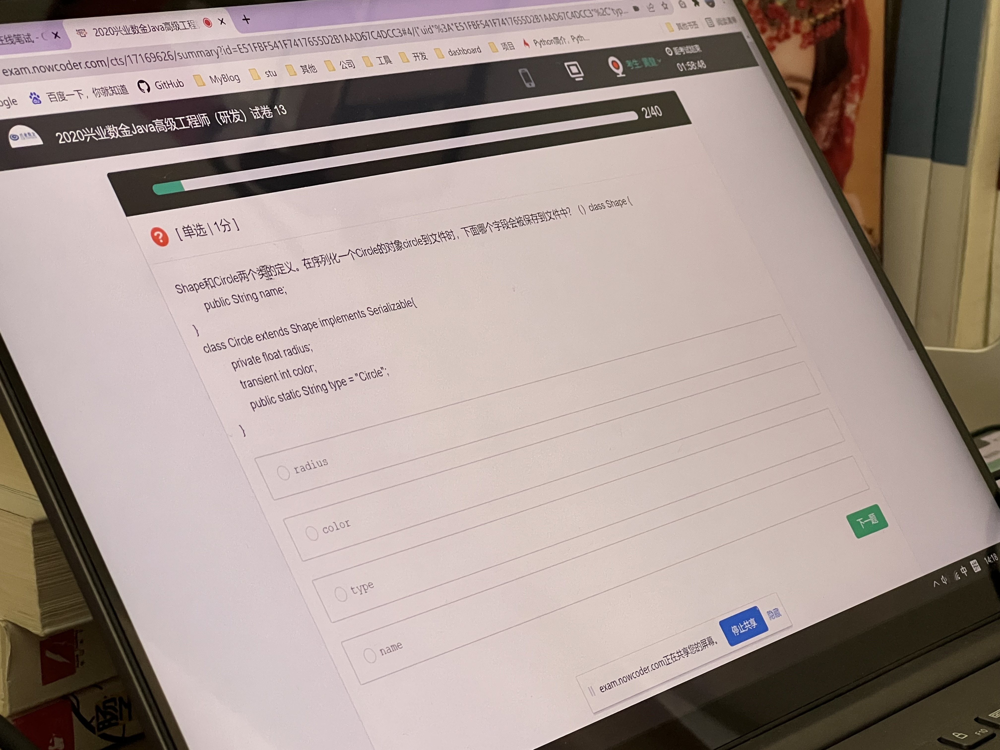

### 单项选择题

1. 下面关于算法的描述正确的是：

- [ ] 算法的空间复杂度是指程序中指令(或语句)的条数  --- 这是时间复杂度
- [x] 算法的有穷性是指算法必须能在执行有限个步骤之后终止
- [ ] 以上三种描述都不对
- [ ] 算法的执行效率与数据的存储结构无关


2. Shape和Circle两个类的定义，在序列化一个Circle的对象circle到文件时，下面哪个字段会被保存到文件中？

```java
class Shape{
	public String name;
}
class Circle extends Shape implements Serializable{
	private float radius;
	transient int color;
	public static String type = "Circle";
}
```

- [x] radius
- [ ] color --- transient 修饰的字段不会被序列化和反序列化
- [ ] type --- 被static修饰的也不会被序列化和反序列话，字段属于类，不属于实例对象
- [ ] name --- 父类没有实现序列化接口




3. 当Oracle服务器启动时，下列哪种文件不是必须的

- [ ] 控制文件 --- 启动的时候检查数据一致性的时候
- [ ] 日志文件 --- 启动的时候需要打开日志文件，因为有的时候需要进行示例恢复，日志文件是必须的
- [x] 归档日志文件 --- 归档只是历史日志文件的备份
- [ ] 数据文件 --- 启动的时候检查数据一致性的时候


4. 在Oracle数据库中，SYSTEM用户模式存储数据字典表和视图对象

- [x] 正确
- [ ] 错误

数据字典 记录了数据库的系统信息，它是只读表和视图的集合，数据字典的所有者为SYS用户，所有的数据字典表和视图都被储存在该数据库的SYSTEM表空间中。用户只能在数据字典上执行查询操作，而其维护和修改是由系统自动完成的。数据字典中存放了数据库自身的很多信息，包括了用于描述数据库和它的所有对象的信息，所以，数据字典是每个Oracle数据库的核心。例如一个表的创建者信息，创建时间信息，所属表空间信息，用户访问权限信息等。


7. ObjectInputStream属于面向字符的输入流

- [ ] 正确
- [x] 错误

ObjectInputStream 继承了 InputStream ，属于字节输入流


13. Mapreduce适用于？

- [ ] 任意可在windows server2008上运行的程序
- [ ] 可以串行处理的应用程序
- [x] 可以并行处理的应用程序
- [ ] 任意应用程序

大数据相关：https://baike.baidu.com/item/MapReduce/133425


12. 登记日志文件必须先写日志文件，后写数据库

- [x] 对
- [ ] 错


1. 日志文件是用来记录事务对数据库的更新操作的文件。 

2. 如果先写了数据库修改，而在运行记录中没有登记这个修改，则以后就无法恢复这个修改了。 

  如果先写日志，但没有修改数据库，按日志文件恢复时只不过是多执行一次不必要的UNDO操作，并不会影响数据库的正确性。


11. 调用sleep()不会释放对象锁，wait()放弃对象锁

- [x] 正确
- [ ] 错误


16. 分析以下Java代码，最终输出的值是

```java
int i = 999;
i--;
i++;
System.out.println(i++);
```

- [x] 999
- [ ] 1000
- [ ] 1001
- [ ] 998


15. 以下对继承的描述错误的是

- [ ] 父类更具有通用性，子类更具体
- [ ] Java中的继承存在着传递性
- [ ] 当实例化子类时会递归调用父类中的构造方法
- [x] Java中的集成允许一个子类集成多个父类 --- Java是单继承的，多实现


22. 实现Oracle数据库中对空表STUDENTS的字段STUDENT_ID上添加主键

- [ ] 

```sql
ALTER TABLE students ADD CONSTRAINT PRIMARY KEY (sutdent_id)
```

- [ ] 

```sql
ALTER TABLE students ADD CONSTRAINT stud_id_pk PRIMARY KEY sutdent_id
```

- [x] 

```sql
ALTER TABLE students ADD CONSTRAINT stud_id_pk PRIMARY KEY (sutdent_id)
```

- [ ] 

```sql
ALTER TABLE students ADD   PRIMARY KEY sutdent_id
```


21. Java持久代满可能会触发full GC 是否正确？

Java触发full GC：

1. 调用 System.gc() ,只是建议虚拟机执行 Full GC，但是虚拟机不一定真正去执行。不建议使用这种方式，而是让虚拟机管理内存。

2. 未指定老年代和新生代大小，堆伸缩时会产生fullgc,所以一定要配置-Xmx、-Xms

3. 老年代空间不足

   1. 为了避免以上原因引起的 Full GC，应当尽量不要创建过大的对象以及数组。

      除此之外，可以通过 -Xmn 虚拟机参数调大新生代的大小，让对象尽量在新生代被回收掉，不进入老年代。

      还可以通过 -XX:MaxTenuringThreshold 调大对象进入老年代的年龄，让对象在新生代多存活一段时间。

      在执行Full GC后空间仍然不足

4. JDK 1.7 及以前的(永久代)空间满

5. 空间分配担保失败,空间担保，下面两种情况是空间担保失败：

   1. 每次晋升的对象的平均大小 > 老年代剩余空间
   2. Minor GC后存活的对象超过了老年代剩余空间


下面代码的运行结果为

```
package com.book.developtest;

/**
 * @author: hj
 * @date: 2022-03-14 14:56
 * @description:
 **/

public class Test2 {
    public static void main(String[] args) {
        String s;
        System.out.println("s=" + s);
    }
}
```

- [ ] 代码得到编译，并输出“s=null"
- [x] 由于String s没有初始化，所以并以不能通过
- [ ] 代码得到编译，但步获到NullPointException异常
- [ ] 代码得到编译，并输出"s="


19. ASCII编码使用指定的7位或者8位二进制数组来表示128或者256种可能的字符 是否正确

正确

https://www.docin.com/p-240499690.html


18. 下面说法正确的有

- [ ] constructor必须与class同名，但方法不能与class同名
- [x] constructor在一个对象被new时执行
- [ ] 一个class只能定义一个constructor
- [ ] class种的constructor不可省略


17. 下列各序列不是堆的是

- [x] 9,4,5,8,3,1,2
- [ ] 9,5,8,4,3,2,1
- [ ] 9,8,5,4,3,1,2
- [ ] 9,8,5,3,4,2,1

堆数据结构：https://www.jianshu.com/p/6b526aa481b1

如何判断一个数组是堆，分为最大堆和最小堆：https://blog.csdn.net/u011240877/article/details/47706923


26. 以下语句有什么作用 

```
GRANT update ON inventory TO joe WITH GRANT OPTION
```

- [x] 一个对象权限被授予用户JOE
- [ ] 用户JOE被授予在这个对象上的所有权限
- [ ] 一个系统权限和一个对象权限被授予用户JOE
- [ ] 一个系统权限被授予用户JOE


25. 在Java多线程种，启动一个线程调用的方法是

- [ ] run()
- [ ] stop()
- [ ] New
- [ ] start()


27. 数据库管理系统由三级模式组成，其中决定dbms功能的是

- [ ] 外模式
- [ ] 内模式
- [ ] 物理模式
- [ ] 逻辑模式


28. 以下哪个流类属于面向字符的输入流

- [ ] FileInputStream
- [ ] ObjectInputStream
- [ ] InpytStreamReader
- [ ] BufferedWriter


29. 在关系数据库设计种，设计关系模式是()的任务

- [ ] 概念设计阶段
- [ ] 逻辑设计阶段
- [ ] 物理设计阶段
- [ ] 需求设计阶段


31. Webservice通信机制实质就是json数据交换，对吗


35. Java种用正则表达式截取字符串种第一个出现的应为左括号之前的字符串可以使用 ,正确吗

```
".*?=\()"
```


36. 执行如下程序代码后，c的值是多少

```java
   int a = 0, c = 0;
        do {
            --c;
            a = a - 1;
        } while (a > 0);
```

答案是  -1


37. JDBC API，用于开启事务的函数是

- [ ] Connection.begin()
- [ ] Connection.beginTransaction()
- [ ] Connection.setAutoCommit(false)
- [ ] Connection.start()


38. 对于已经被定义过可能抛出异常的语句，在编程时

- [ ] 如果程序错误，必须使用try/catch 语句处理异常
- [ ] 可以置之不理
- [ ] 只能使用try/catch语句处理
- [ ] 必须用try/catch语句处理异常，或用throws将其抛出


39. 以下代码运行的结果是什么

```java
        int a = 0;
        int b = a;
        if (a > 1 & ++a > 0) {
            b++;
        }
        if (b > 1 && ++b > 0) {
            b--;
        }
        System.out.println("a = " + a); //a= 1
        System.out.println("b = " + b);//b= 0
    
```


40. 一个栈的输入序列位1 2 3 4 5，下列序列不可能是栈输出的序列是

- [ ] 2 3 4 1 5
- [ ] 1 5 4 3 2 
- [ ] 2 3 1 4 5
- [ ] 5 4 1 3 2


### 多选题

1. 下面有关Java异常类描述，正确的是

- [ ] 非RuntimeException一般是外部错误(非Error),其必须被try{}catch语句所捕获
- [ ] Error类体系描述了Java运行系统中的内部错误以及资源耗尽的情形，Error不需要捕捉
- [ ] RuntimeExpception体系包括错误的类型转换，数组越界访问和试图访问空指针等，必须要try{}catch语句步获
- [ ] 异常的继承结构：基类为Throwable,Error和Exception集成Throwable，RuntimeException和IOException等集成Exception


2. 下列关于类说法正确的是

- [ ] 类中包含数据变量和方法
- [ ] 类是对所有具有一定共性的对象的抽象
- [ ] Java语言的类只支持单继承
- [ ] 类是Java语言中的一种符合数据类型


4. 将可以运行的JDK解压到C:/java/JDK1.6的目录中，然后启动命令窗口，输入java -version命令，操作系统提示"java"不是内部或外部命令，也不是可运行的程序或批处理文件”，可能的原因是

- [ ] 未在环境边量path中添加以下路径：C:\java\JDK1.6\bin
- [ ] 命令行窗口当前目录部署C:\java\JDK1.6\bin
- [ ] 要获得可运行的JDK环境，必须通过安装包进行安装
- [ ] 未设置环境变量JAVA_HOME=C:\java\JDK1.6\bin


3. 在Java中构造BufferedInputStream的合适参数

- [ ] BufferedOutputStream
- [ ] FileInputStream
- [ ] FileOuterStream
- [ ] BufferedInputStream


5. 以下描述正确的有

- [ ] abstract修饰的类主要用于被继承
- [ ] abstract可以修饰变量
- [ ] abstract修饰的类，其子类也可以是abstract修饰的
- [ ] abstract可以修饰类、接口、方法


6. 如何在多线程下避免发生死锁

- [ ] 允许进程强行从占有者那里夺取某些资源
- [ ] 进程在运行前一次性的向系统申请它所需的全部资源
- [ ] 把资源实现分类编号，按好分配，使进程在申请，占用资源是不会形成环路
- [ ] 允许进程同时访问某些资源


9. 这道题选B和D，注重一下话术


11. 在J2EE中，下列关于JSP的scriptlet的陈述正确的是

- [ ] scriptlet可以包含import语句
- [ ] scriptlet不但包含Java代码，还可以包含html语句
- [ ] 整个JSP可以有多个<%和%> 对
- [ ] scriptlet是包含在<%和%> 之间的


12. 下列关于spring mvc和structs2的描述正确的是

- [ ] spring mvc是基于方法的设计，而structs2是基于类的设计
- [ ] structs2有以interceptor机制，spring mvc用的是独立的AOP方式
- [ ] spring mvc的方法之间基本是独立的，独享request response数据，structs2所有的Action变量是共享的
- [ ] spring mvc的入口是filter，而struts2是servlet


14. 下列说法正确的

- [ ] 在编译程序的时候，所能指定的环境变量不包括classpath
- [ ] javac一次可同时编译数个Java源文件
- [ ] javac.exe能指定编译结果要置于哪个directory目录
- [ ] 环境变量可以在编译source code 源编译 时指定


15. Java集合类包括ArrayList、LinkedList、HashMap等，以下正确的有

- [ ] ArrayList的访问速度比LinkedList快
- [ ] 添加和删除元素的时候，ArrayList表现更好
- [ ] HashMap实现Map接口，它允许任何类型的键值对象，并允许将null作为键或值
- [ ] ArrayList和LinkedList均实现了List接口


18. 在J2EE中，对于HttpServlet的描述，正确的是

- [ ] HttpServlet类扩展了GenericServlet类，实现了GenericServlet类的抽象方法service()
- [ ] HttpServlet类有两个service()方法
- [ ] 我们自己编写Servlet继承了HttpServlet，一般只需要覆盖doPost或者doGet方法，不必覆盖service()方法，因为一个service()方法会调用doPost或者doGet方法
- [ ] 我们自己编写Servlet继承了HttpServlet，一般只需要覆盖doPost或者doGet方法，不必覆盖service()方法，因为一个service()方法是空的


19. 以下哪些是JDK中额外提供的一些辅助工具

- [ ] jinfo
- [ ] jmap
- [ ] jhat
- [ ] jstat

