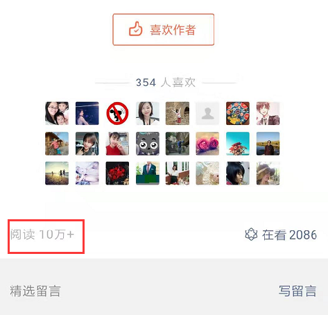
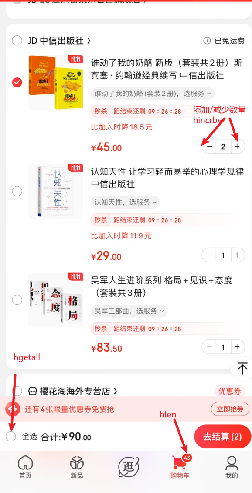
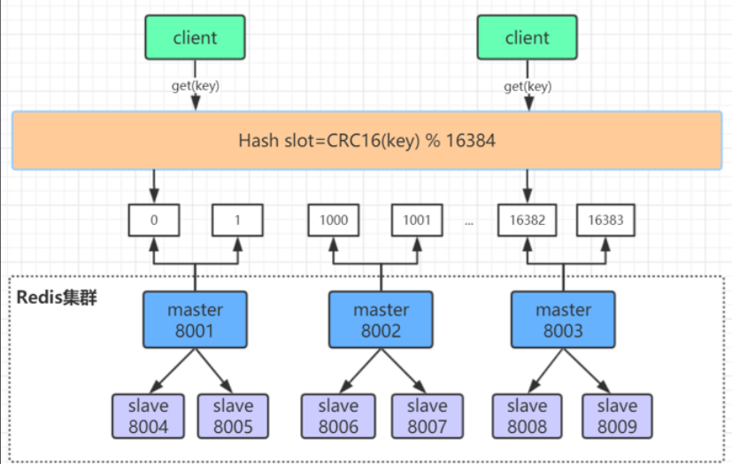
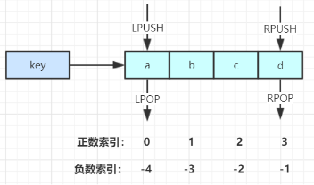
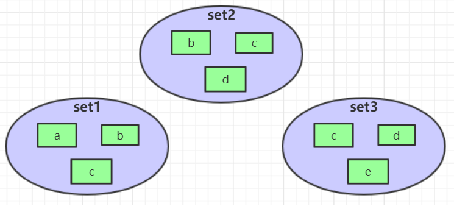

# Redis

## 核心数据结构


### String字符串

#### 常见命令

**常见操作**

存入字符串键值对

```
SET key value
```


批量存储字符串键值对

```
MSET key value [key value...]
```


当某一个键值对不存在时设置

```
SETNX key value
```


获取 key 对应的值

```
GET key
```


批量获取字符串键值

```
MGET key [key...]
```


删除key，可批量删除

```
DEL key [key...]
```


设置一个键的失效时间

```
EXPIRE key seconds
```


**原子加减**

将key对应的数字值加1

```
INCR key
```


将key对应的数字值减1

```
DECR key
```


将key所存储的值加上对应的值

```
INCBY key num
```


将key所存储的值减去对应的值

```
DECRBY key num
```


#### 应用场景

**单值缓存**

使用 set key 和 get key 适用于简单的缓存场景


**对象缓存**

可以将我们常见的对象转为json字符串作为value存储；

将一个对象的 k:v 分开存储。

- SET user:123 value(json格式话数据)
- MSET user123:name  xiaohuang user123:age 22  //批量设置
- MGET user123:name user123:age  //批量获取


**分布式锁**

> 此处为分布式锁的简单实现，真实场景不是这么实现的

使用SETNX 命令，当设置成功返回1时表示拿到锁，返回0表示没有拿到锁

```
SETNX  user:123  true  
```

设置过期时间，防止死锁

```
SETNX user:123 true ex 10 nx
```


**计数器**

例如微信文章的阅读次数；每阅读一次则将数字加一

```
INCR article:count:id
```




**Web集群session共享**

spring session + redis 实现session共享


**分布式系统获取序列号**

采用号段的思想，减少从redis获取分布式id的次数，降低redis的压力

INCRBY orderId 1000 


### Hash

#### 常见命令

存储一个field及其对应的值

```
HSET key field value
```


如果不存在field则存储

```
HSETNX key field value
```


批量设置field 和 value

```
HMSET key field value [field value ...]
```


获取某个field对应的值

```
HGET key field
```


获取多个field对应的值

```
HMGET key field field [field...]
```


删除某个field及其对应的值

```
HDEL key field [field]
```


返回hash表key中对应的field数量

```
HLEN key
```


给某个field的值增减对应的数值

```
HINCRBY key field increment 
```


#### 应用场景

**对象缓存**

hash类型存储的结构就类似于我们对象的 key value结构，一个字段对应一个值，所以适合存储对象。

例如将json结构的对象缓存在redis中

```json
{
 "name": "xiaohuang",
 "age": 18
}
```

```
HMSET user1 name xiaohuang age 18 
```


**电商购物车**

- 以用户的id为key
- 商品的id为field
- 商品数量为value

**购物车操作**

- 添加商品

```
hset cart:001 10001 1
```

- 增加商品的数量

```
hincrby cart:001 10001 1w
```

- 商品的总数

```
hlen cart:001 
```

- 删除某个商品

```
hdel cart:001 10001
```

- 获取购物车的所有商品

```
hgetall cart:001
```




#### 优点

- 同类型的数据可以整合存储，方便管理和查询。(同一个类型的数据以 k:v 的形式存储更容易归类)
- 相比string 类型操作消耗的内存和cpu都更小 (此处涉及redis存储的底层数据结构后续会解释更新)
- 相比较于string更节省内存空间(此处涉及redis存储的底层数据结构后续会解释更新)


##### 缺点

- 过期功能不能使用在field字段上，只能对key进行过期操作
- Redis集群架构下不适合大规模使用：集群模式下部署redis时，数据存储和查询时，通过hash算法，会将某个hash类型值存储到集群的某个节点上，造成数据的不平衡。




### List

#### 常见命令

将一个或多个值value插入到list的**左侧**

```
LPUSH key value [value...]
```


将一个或多个值value插入到list的**右侧**

```
RPUSH key value [value...]
```


移除并返回列表最左侧的元素

```
LPOP key
```


移除并返回列表**最右侧**的元素

```
RPOP key
```


返回列表指定区间内的元素，start在左，stop在右

```
LRANGE key start stop
```


从列表的左侧弹出元素，如果没有元素，则阻塞等待超时间timeout，如果timeout=0，则一直阻塞

```
BLPOP key [key...] timeout 
```


从列表的**右侧**弹出元素，如果没有元素，则阻塞等待超时间timeout，如果timeout=0，则一直阻塞

```
RLPOP key [key...] timeout 
```





#### 应用场景

**实现一些数据结构**

Stack ： LPUSH + LPOP

Queue：LPUSH + RPOP

Blocking MQ (阻塞队列) = LPUSH + BRPOP


**微博和微信公众号消息流**

我关注的稀土掘金公众号 ，上海发布公众号

1. 稀土掘金发文章(id001)，推送消息给我自己

```
LPUSH xiaohuang id001
```

2. 上海发布发文章(id002)，推送消息给我自己

```
LPUSH xiaohuang id002
```

3. 查看最近的消息

```
LRANGE xiaohuang 0 4
```

以上都是一些简单实现，如果考虑到关注的公众号粉丝比较多，那么逐个推送会对redis造成比较高的压力，所以可以分为两种情况

- push：推送适用于关注量较小的用户，可以直接将消息推送给粉丝


- pull：拉取时需要去队列中去拿消息，拿完消息后需要排序


### Set

#### 常见命令

向set集合中存储元素，元素存在则忽略并且返回0，元素不存在则新增返回1

```
SADD key member [member...]
```


从集合中删除元素

```
SREM key member [member...]
```


获取key对应集合的所有元素

```
SMEMBERS key
```


获取key对应集合的元素个数

```
SCARD KEY
```


判断member元素是否在key对应的集合中

```
SISMEMBER key member
```


从集合中随机选出count个元素

```
SRANDMEMBER key count 
```


从集合中拿出count个元素，元素从集合中删除

```
SPOP key count
```


**运算操作**

交集运算

```
SINTER key key ...
```


将交集结果存入到一个新集合destination中

```
SINTERSTORE destination key key ...
```


并集运算

```
SUNION key key ...
```


将并集结果存入到一个新集合destination中

```
SUNIONSTORE destination key key ...
```


差集运算

```
SDIFF key key ...
```


将差集结果存入到一个新集合destination中

```
SDIFFSTORE destination key key ...
```


#### 应用场景

**微信抽奖小程序**

1. 点击参与抽奖加入集合

```
sadd key userid
```

2. 查看参与抽奖的所有用户

```
smembers key
```

3. 抽取count名中奖者 ,srandmember 和 spop 取决于你是否允许中奖的人重复获奖

```
srandmember key count /spop key count
```


**点赞、收藏、标签**

1. 点赞

```
sadd like:blogid userid
```

2. 取消点赞

```
srem like:blogid userid
```

3. 检查用户是否点赞了

```
sismember like:blogid userid
```

4. 获取点赞的用户列表

```
smembers like:blogid userid
```

5. 获取点赞的用户数

```
scard like:blogid userid
```


**集合操作(集合中元素都不相同)**



sinter set1 set2  set3  ---> c

sunion set1 set2 set3 ---> a,b,c,d,e

sdiff set1 set2 set3 --->  a


**实现微博关注模型**

1.  库克关注的人: 
   kukeSet-> {leijun, mask}
2. 比尔盖茨关注的人:
    billgatesSet--> {kuke, yuchengdong, leijun, mask}
3.  雷军关注的人: 
   leijunSet-> {luolaoshi, billgates, yuchengdong, mask, xiaofu)
4. 库克和比尔盖茨共同关注: 
   SINTER kukeSet billgatesSet--> {leijun, mask}
5. 库克关注的人也关注他(比尔盖茨): 
   SISMEMBER leijunSet billgates 
   SISMEMBER maskSet billgates
6. 库克可能认识的人(比尔盖茨的好友): 
   SDIFF billgatesSet kukeSet->(kuke, yuchengdong}


### ZSet

#### 常用命令

向有序集合中添加带分值的元素

```
ZADD key score member [[score member]…]
```


向有序集合中删除元素

```
ZREM key member [member …]
```


返回有序集合key中元素member的分值

```
ZSCORE key member 
```


为有序集合key中元素member的分值加上increment

```
ZINCRBY key increment member
```


返回有序集合key中元素个数

```
ZCARD key
```


正序获取有序集合key从start下标到stop下标的元素

```
ZRANGE key start stop [WITHSCORES]
```


倒序获取有序集合key从start下标到stop下标的元素

```
ZREVRANGE key start stop [WITHSCORES]	
```


**集合操作**

并集计算

```
ZUNIONSTORE destkey numkeys key [key ...] 	
```


交集计算

```
ZINTERSTORE destkey numkeys key [key …]	
```


#### 应用场景

**实现排行榜的功能**

1. 点击新闻

   ```
   ZINCRBY  hotNews  1  小猪佩奇
   ```

2. 展示当日排行前十

   ```
   ZREVRANGE  hotNews  0  9  WITHSCORES 
   ```

3. 七日搜索榜单计算

   ```
   ZUNIONSTORE  hotNews:week  7  hotNews:2  hotNews:3... hotNews:7
   ```

4. 展示七日排行前十

   ```
   ZREVRANGE hotNews:week  0  9  WITHSCORES
   ```

   