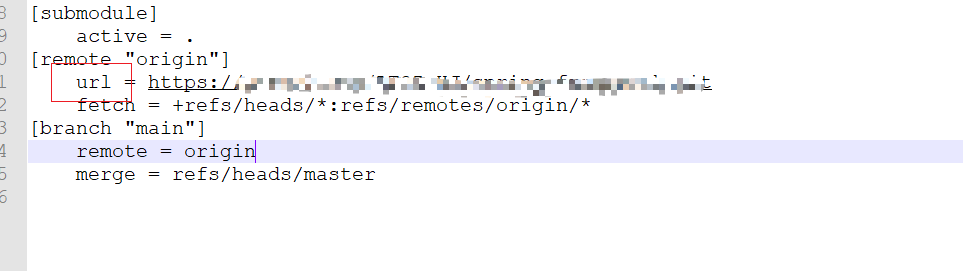

### Git仓库变更，如何修改本地代码的远程仓库？

1. 修改 .git 文件中




2. 执行以下命令，实际就是在你创建GitHub仓库后，GitHub的建议操作内容，然后等待推送完成即可

```
git remote add origin https://github.com/xxxxxx/xxxxxxxx.git
git branch -M main
git push -u origin main
```

