### Gradle安装与配置，Spring源码导入


#### Gradle安装背景

1. 由于需要在本地编译spring源码，所以需要安装配置Gradle环境


#### 下载

1. 前往官网下载压缩包: 

   [官网地址]: https://gradle.org/install/#manually

2. 分为两种下载方式，第一种是 binary-only，二进制代码；第二种 complete包含文档等内容，如有需要可下载complete版本

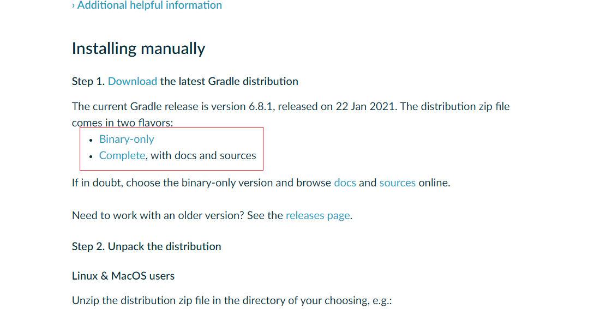


#### 安装

1. 解压下载后的压缩包到你想要安装的目录  `D:\development`


#### 本地配置

1. 编辑系统变量，创建 `GRADLE_HOME`，指定gradle解压后的目录(起始就是bin目录所在的目录)

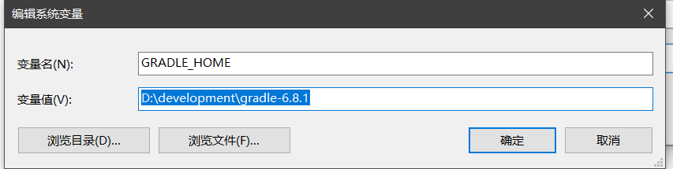

2. 编辑系统变量，创建`GRADLE_USER_HOME`，指定gradle仓库，或者直接指定为maven仓库

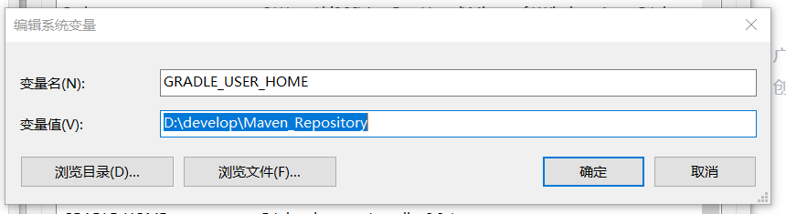

3. 修改环境变量Path，添加 `%GRADLE_HOME%\bin`


#### 配置Gradle仓库源

在gradle的安装目录下的，init.d文件夹下，新建一个init.gradle 文件，粘贴以下配置

```text
allprojects {
    repositories {
        maven { url 'file:///D:/develop/gradle_repository'}
        mavenLocal()
        maven { name "Alibaba" ; url "https://maven.aliyun.com/repository/public" }
        maven { name "Bstek" ; url "http://nexus.bsdn.org/content/groups/public/" }
        mavenCentral()
    }

    buildscript { 
        repositories { 
            maven { name "Alibaba" ; url 'https://maven.aliyun.com/repository/public' }
            maven { name "Bstek" ; url 'http://nexus.bsdn.org/content/groups/public/' }
            maven { name "M2" ; url 'https://plugins.gradle.org/m2/' }
        }
    }
}	
```

解释：**repositories**  中填写的是gradle获取依赖的顺序

**maven**: 表示的是本地仓库地址

**mavenLocal()**：同样表示的是获取本地仓库的地址

接下来依次是阿里的和国外的仓库地址

**mavenCentral()**: 中央仓库


### Spring源码


#### Spring源码下载

1. 点击Spring源码仓库地址

   [GitHub仓库地址]: https://github.com/spring-projects/spring-framework

2. 选择需要下载的版本

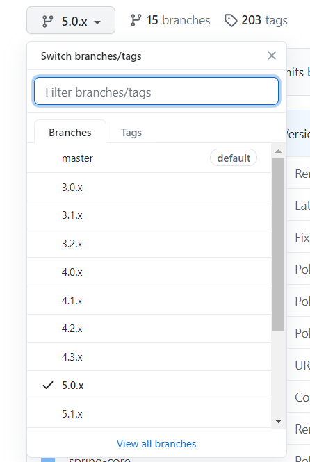


3. 复制地址，下载到你的目录下

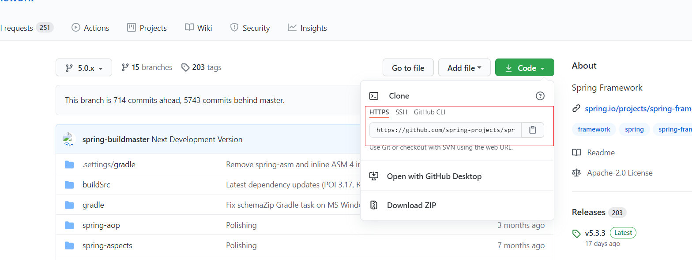


#### Spring源码编译

1. 可参考spring源码仓库中提供的 Build 文档

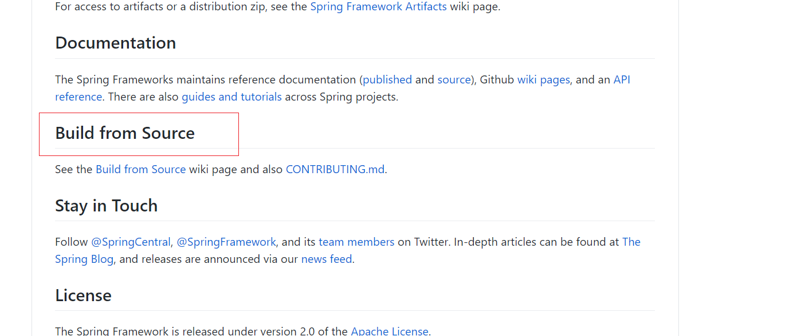


2. 确保本地环境已经准备完成，我的是jdk1.8，Gradle 6.8.1, win10
3. 修改项目根目录下的 build.gradle  文件，打开并且添加阿里云的仓库，下载依赖会更快

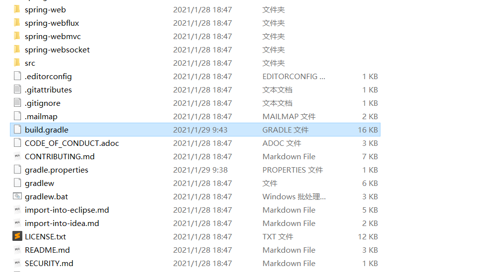

```
repositories {
			mavenCentral()
			maven { url "https://repo.spring.io/libs-spring-framework-build" }
			maven { url "https://repo.spring.io/snapshot" } // Reactor
			maven {url 'https://maven.aliyun.com/nexus/content/groups/public/'} //阿里云
			maven {url 'https://maven.aliyun.com/nexus/content/repositories/jcenter'}
		}
```


4. windows环境下，查看spring-framework 根目录，运行名称为 gradlew.bat 的脚本，建议使用命令的方式执行，可以看到执行过程，如果报错了，可以看到错误信息
5. 在导入到idea中的时候，需要预编译一下oxm这个项目，在cmd中运行 `gradlew :spring-oxm:compileTestJava`


#### 导入到idea


1. idea配置修改

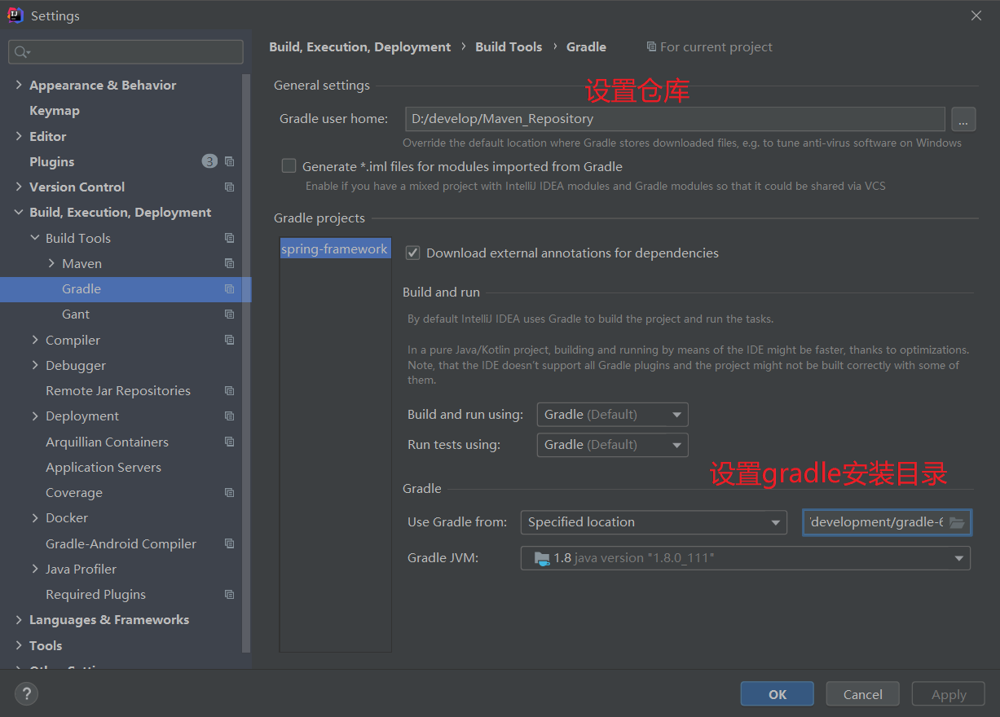


2. 打开项目

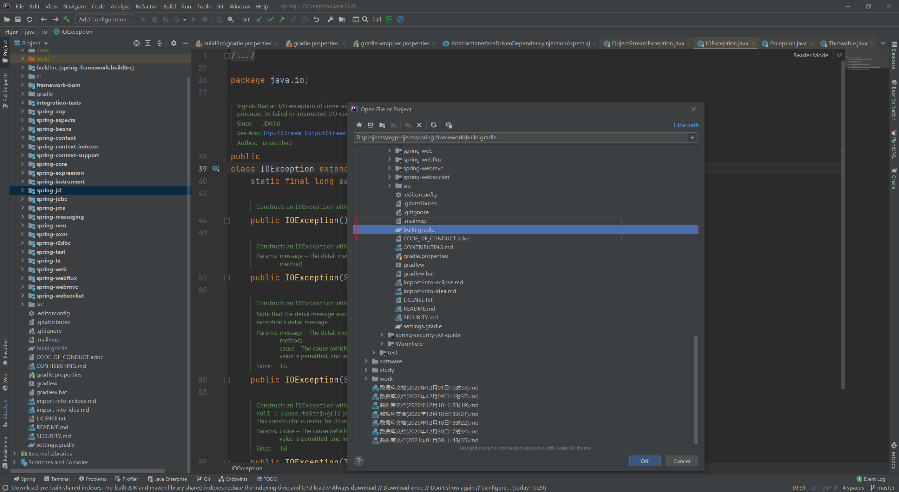


3. idea将会建立所以请内心等待，笔者在使用idea导入的时候，idea版本为2019.3.1时，报错如下，后将idea版本更换为2020.3.2，问题解决

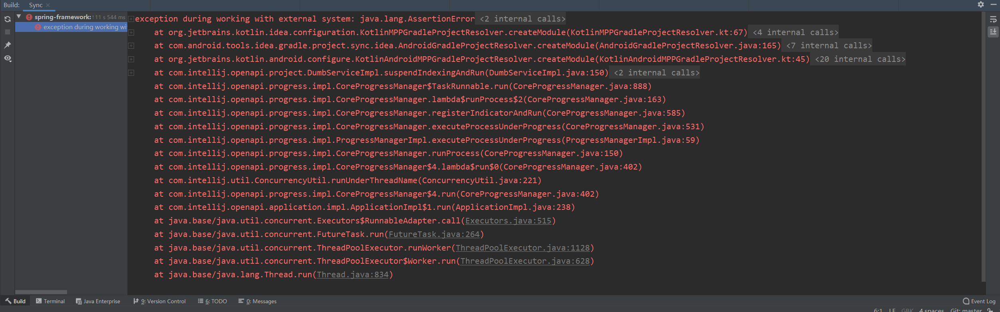


4. 正确构建后，效果如下

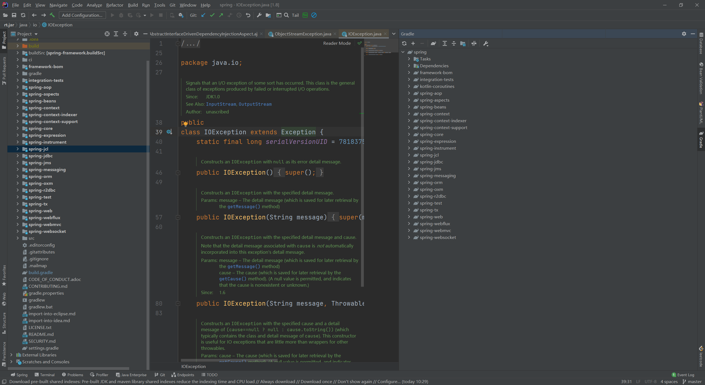


。。。。。。待完善