## Kettle

### 简介

开源的ETL工具，完全由Java编写。

可以完成数据的抽取、转换、加载。

目前被日立收购，更名为PDI（Pentaho Data Integration）。


### 组成部分

|    名称     |                            描述                            |
| :---------: | :--------------------------------------------------------: |
|  **Spoon**  |         通过图形接口，用于编辑作业和转换的桌面应用         |
|   **Pan**   |   一个独立的命令行程序，用于执行由Spoon编辑的转换和作业    |
| **Kitchen** |      一个独立的命令行程序，用于执行由Spoon编辑的作业       |
|  **Carte**  | Carte是一个轻量级的Web容器，用于建立专用、远程的ETL Server |


### 下载

点击[下载地址](https://sourceforge.net/projects/pentaho/files/)，可选择不同的版本进行下载。

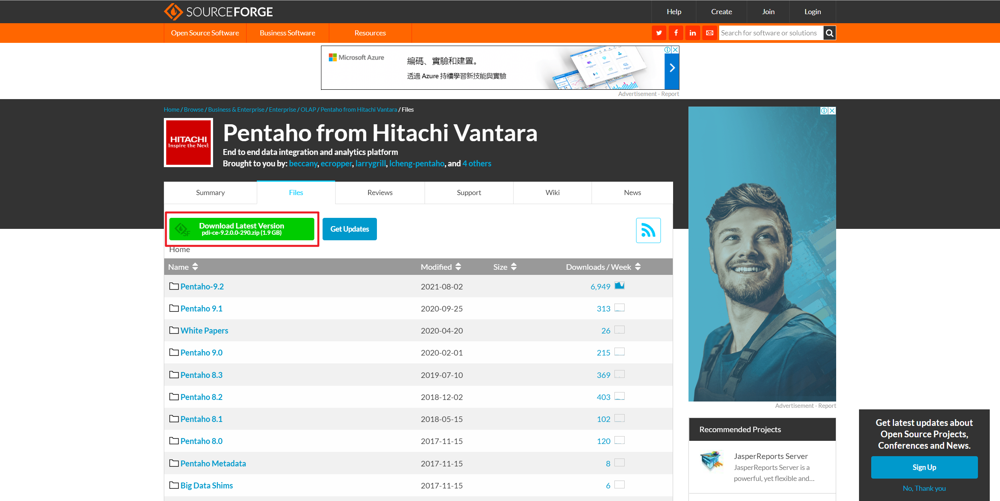


### Windows上使用与配置

#### 解压启动

1. 解压下载的文件，打开解压后的目录
2. 双击Spoon.bat，打开图形化界面

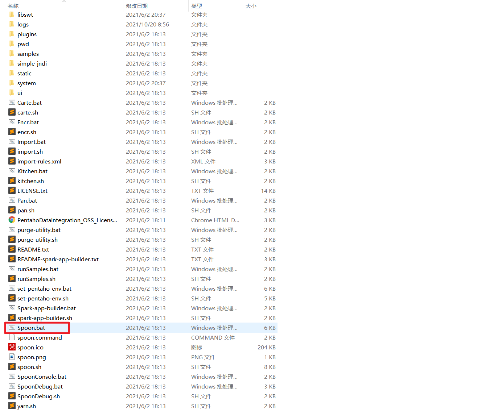


3. 启动后的界面

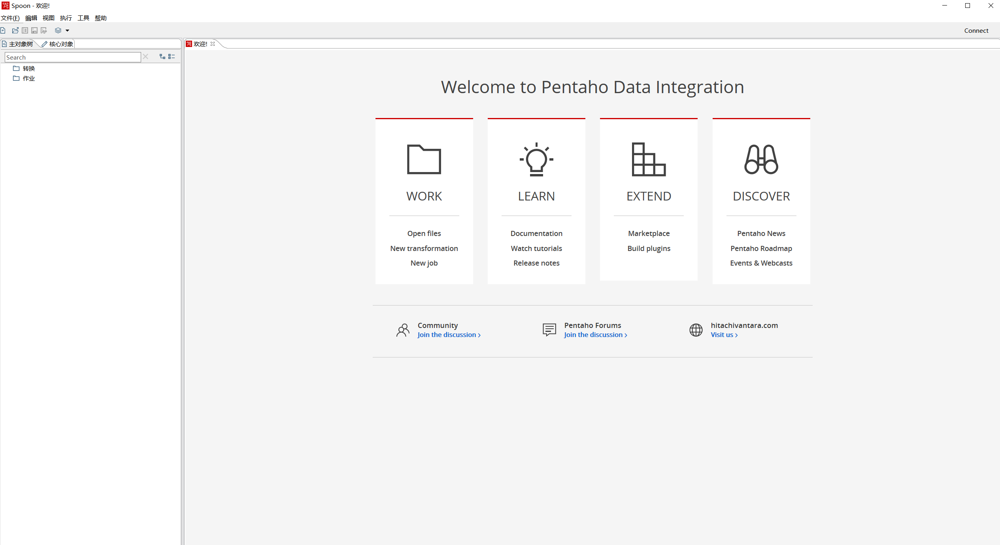


#### 导入数据库驱动

1. 将数据库驱动导入到 **lib** 目录下

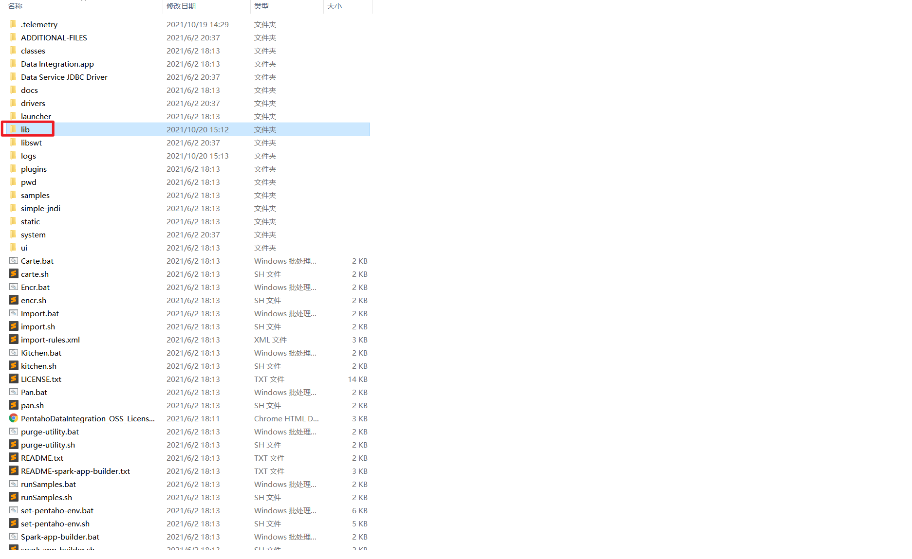

2. 导入后的数据库驱动文件

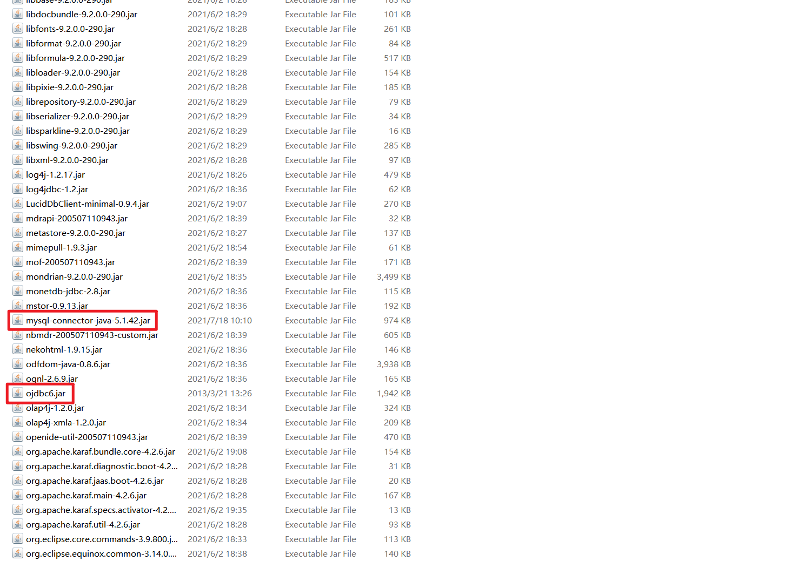


#### 新增数据库信息

1. 双击客户端界面左侧 **转换**，新增一个转换操作

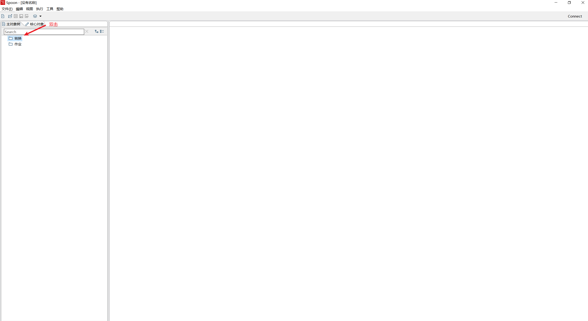


2. 创建Oracle和MySQL数据库连接

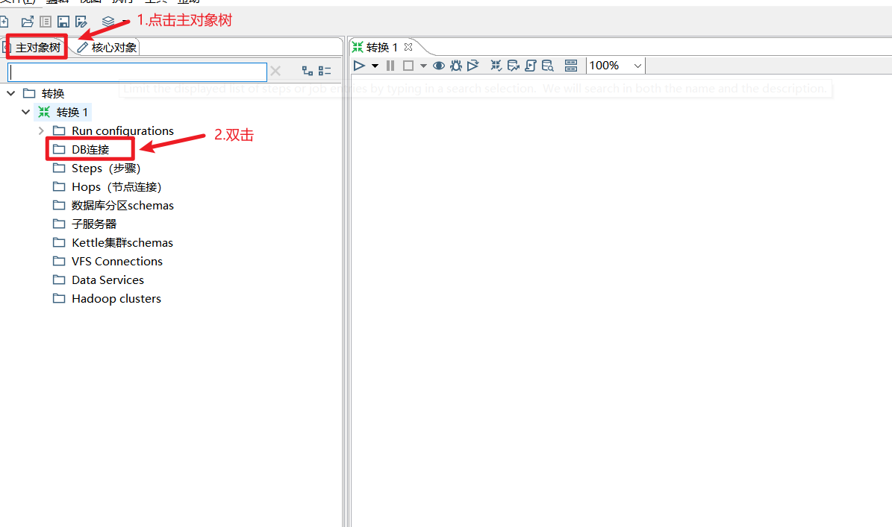


3. 配置Oracle连接信息，点击测试成功后，点击确认

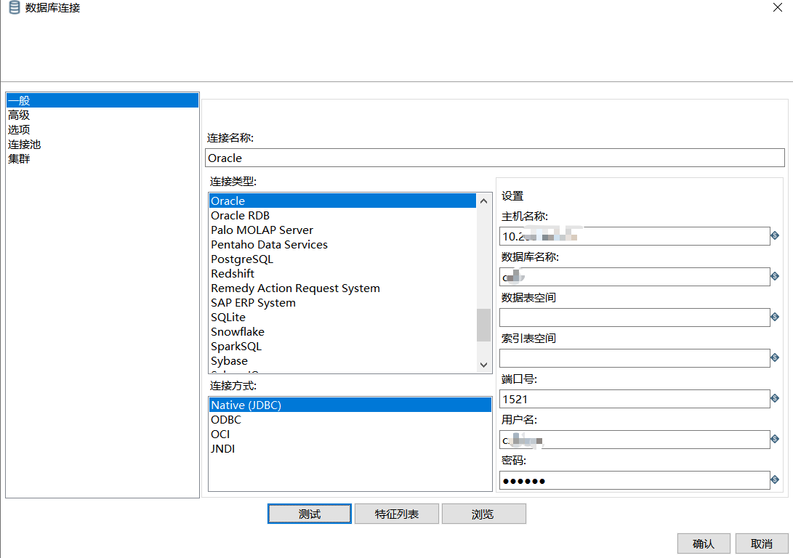


4. 配置MySQL连接信息，点击测试成功后，点击确认

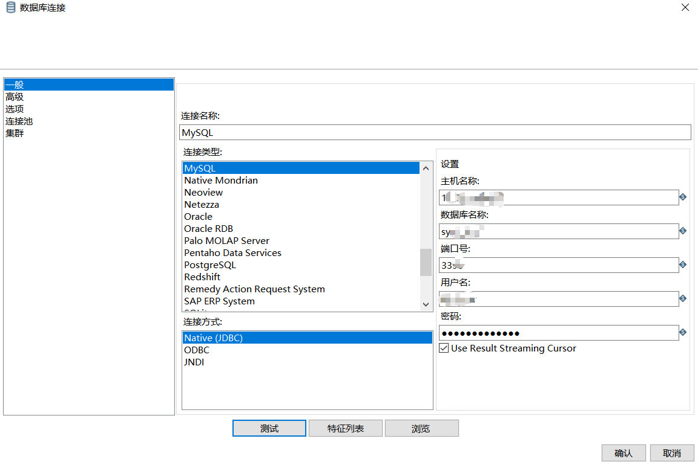

5. 测试成功后显示信息

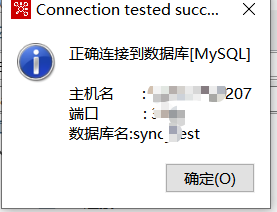


6. 配置连接信息字符集，我这里配置MySQL连接信息的字符集，其他为默认配置

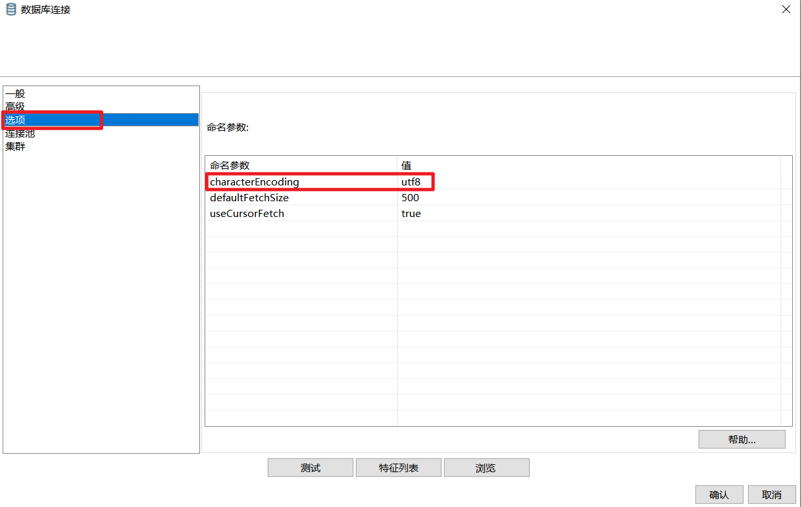


#### 配置转换操作

1. 点击界面**核心对象**，双击 **表输入**

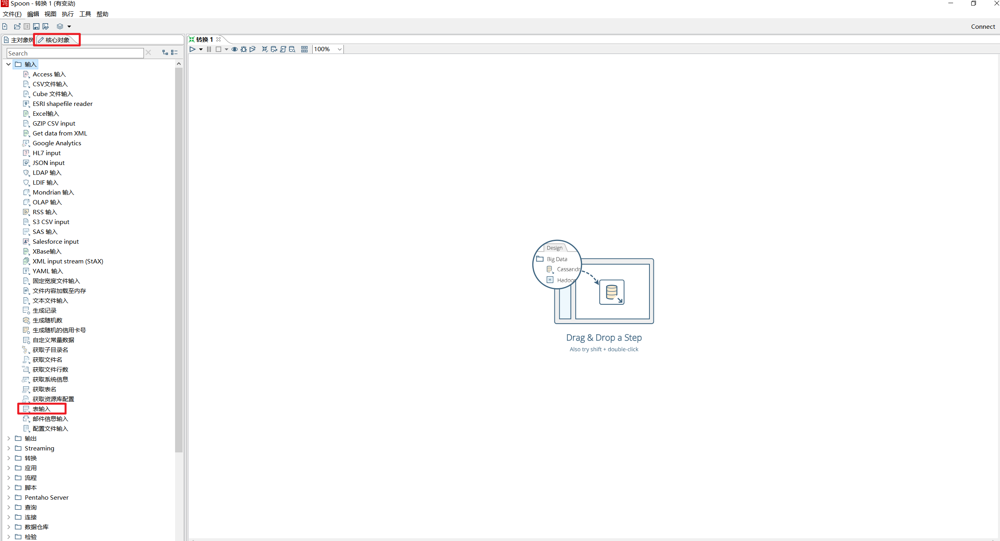


2. 双击**表输入**图标，选择Oracle作为表输入的数据库，确定

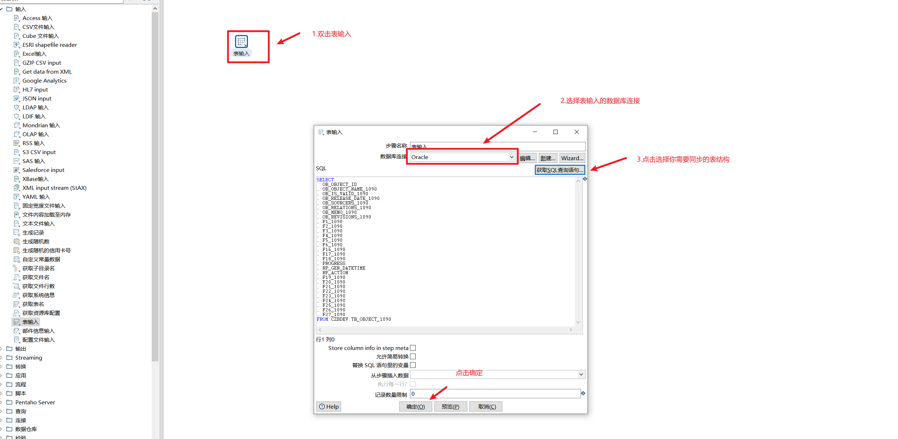


3. 点击界面**核心对象**，双击 **表输出**


4. 双击**表输出**图标，选择MySQL作为表输出的数据库，确定

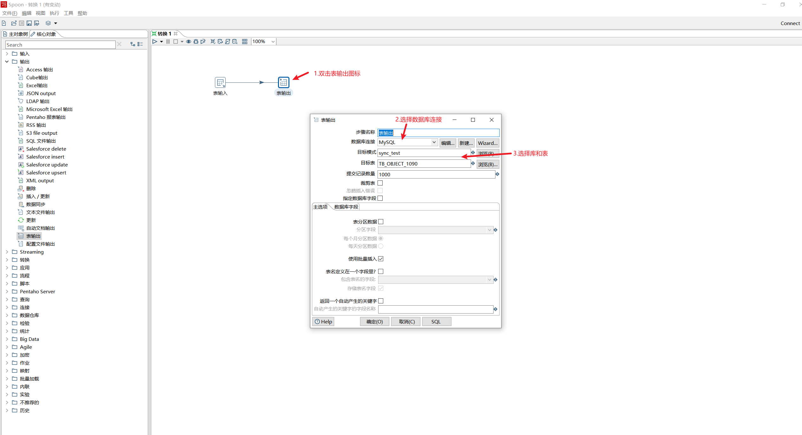


#### 保存转换文件

CTRL+S 保存 .ktr 格式的文件


#### 执行转换

点击启动开始转换，可在控制台查看执行结果日志


### Linux上使用与配置

### 默认配置

1. 默认安装了jdk1.8


#### 上传安装包

1. 压缩Windows上的安装目录 **data-integration** ，因为我们之前已经将数据库的驱动放进去
2. 上传到Linux的指定目录下 **/home/pdi**
3. 解压，进入到  **data-integration** 目录

```
cd /home/pdi/data-integration
```


#### 脚本赋权

1. 执行命令，对脚本赋予执行权限 

```
chmod a+x *.sh
```


#### 安装依赖包

1. 上传 *webkitgtk-2.4.9-1.el7.x86_64.rpm* 包到  **/home/pdi ** 目录下
2. 执行命令安装

```shell
 yum install webkitgtk-2.4.9-1.el7.x86_64.rpm 
```


#### 执行转换文件

1. 创建files目录

```shell
mkdir files
cd files
```

2. 上传我们刚刚在Windows平台保存的  **.ktr**  文件 到 **files** 目录下
3. 执行转换命令

```shell
cd /home/pdi/
mkdir logs
cd /home/pdi/data-integration
```

```sh
./pan.sh -file=/home/pdi/data-integration/files/TB_OBJECT_1090_O2M.ktr >> /home/pdi/logs/pdi.log
```


1. 定时执行
2. 日志输出到指定文件
3. 考虑无法在win上连接数据库的情况
