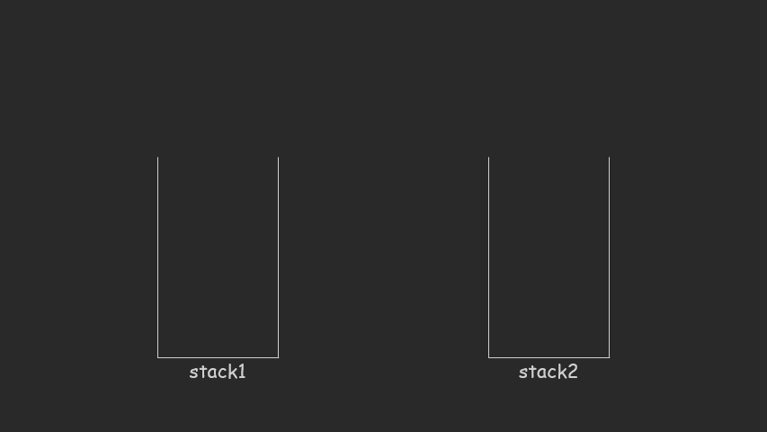

## 用两个栈实现队列

### 题目描述

```
用两个栈实现一个队列。队列的声明如下，请实现它的两个函数 appendTail 和 deleteHead ，分别完成在队列尾部插入整数和在队列头部删除整数的功能。(若队列中没有元素，deleteHead 操作返回 -1 )

 

示例 1：

输入：
["CQueue","appendTail","deleteHead","deleteHead"]
[[],[3],[],[]]
输出：[null,null,3,-1]
示例 2：

输入：
["CQueue","deleteHead","appendTail","appendTail","deleteHead","deleteHead"]
[[],[],[5],[2],[],[]]
输出：[null,-1,null,null,5,2]
提示：

1 <= values <= 10000
最多会对 appendTail、deleteHead 进行 10000 次调用
```


### 题意解读

栈的特点是先进后出，队列的特点是先进先出。

当插入元素的时候，直接插入到A栈中；当需要取元素时，我们将A栈中的元素按顺序 **倒入** 到Stack2中，再从Stack2中取出元素。每次取值的时候，先判断Stack2是否为空，如果Stack2为空，则将Stack1中的元素弹出放到Stack2中，再弹出元素。

stack1作为插入元素的栈；stack2作为删除元素的栈。




### 代码实现

```Java
public class CQueue {
    LinkedList<Integer> stackA;
    LinkedList<Integer> stackB;

    public CQueue() {
        stackA = new LinkedList<>();
        stackB = new LinkedList<>();
    }

    public void appendTail(int value) {
        stackA.push(value);
    }

    public int deleteHead() {
        // 判断b是否为空,b为空，将a中元素插入
        if (stackB.isEmpty()) {
            while (!stackA.isEmpty()) {
                stackB.push(stackA.pop());
            }
        }
        if (!stackB.isEmpty()) {
            return stackB.pop();
        } else {
            return -1;
        }
    }

}
```


## 包含min函数的栈

### 题目描述

```
定义栈的数据结构，请在该类型中实现一个能够得到栈的最小元素的 min 函数在该栈中，调用 min、push 及 pop 的时间复杂度都是 O(1)。

 

示例:

MinStack minStack = new MinStack();
minStack.push(-2);
minStack.push(0);
minStack.push(-3);
minStack.min();   --> 返回 -3.
minStack.pop();
minStack.top();      --> 返回 0.
minStack.min();   --> 返回 -2.
 

提示：

各函数的调用总次数不超过 20000 次

来源：力扣（LeetCode）
链接：https://leetcode-cn.com/problems/bao-han-minhan-shu-de-zhan-lcof
```

