## 错题集

### 第一天


题解额：选线B描述的C语言；选项C中，string类型比较内容时可以使用equals方法，因为String类重写了equals方法；char类型在Java中存储的是Unicode，不仅可以存储ASCII值，还可以存储汉字，所以这里错选d选项主要还是对于char类型的编码类型不够了解


------

 


题解：此题普及 无效等价类的概念：即不满足程序输入要求或者无效的输入数据构成的集合。与有效等价类含义相反


------


题解：题目考察对于集合体系概念的了解；因为不熟悉，所以导致的犯错，如下位集合体系的简单结构图

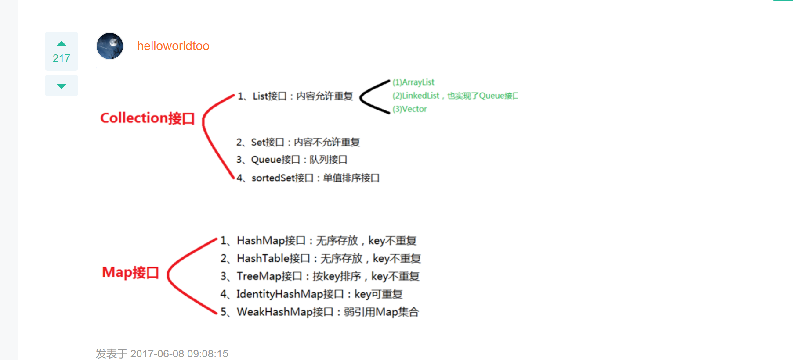


------

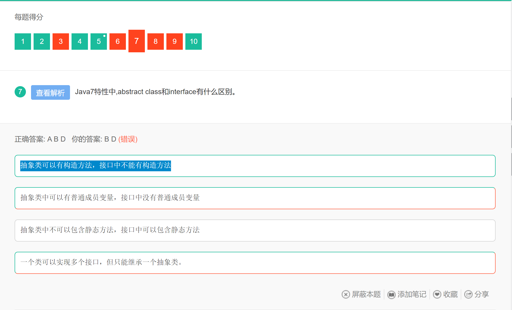


**此题考查 抽象类和接口的区别**

------


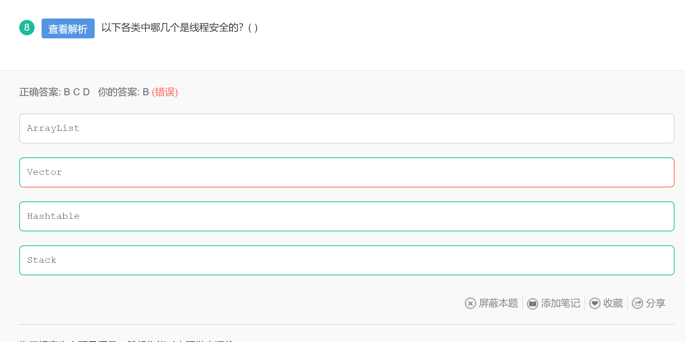


此题考察集合体系中的线程安全和线程不安全的分类。

以下为参考答案，也有网友总结为 V SHE ，vector，stack，hashtable，enumeration

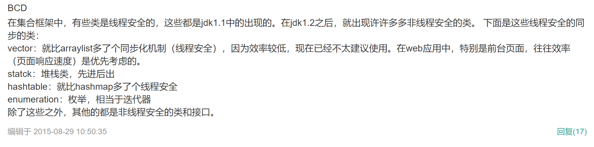


-------


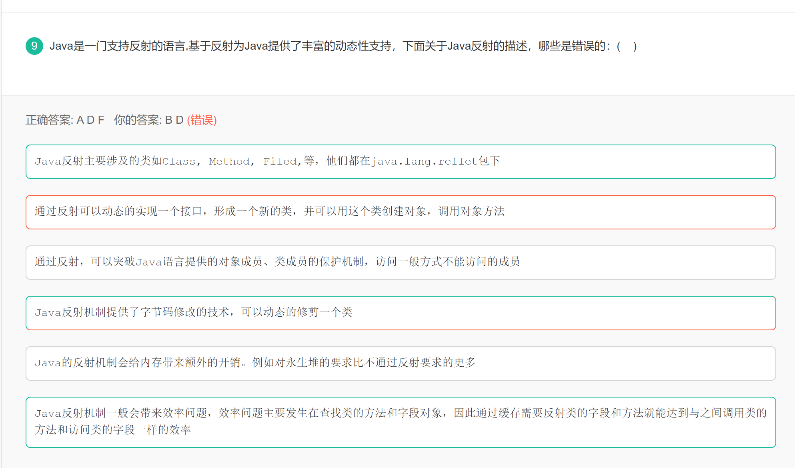


考察对Java反射机制的了解

1. A中Class类是在lang包下的
2. D选项中反射是动态获取一个类的信息，而不是修剪
3. F选项中，反射降低执行效率不是通过缓存就可以解决的，反射带来的效率问题主要是动态解析类，JVM没法对反射代码优化


-------


这一题也很有代表性，考察了对Java内存空间的了解，对于常量池中包含哪些元素需要进一步了解


### 第二天(6月14日) 菜鸡，错这么多

#### 正则表达式

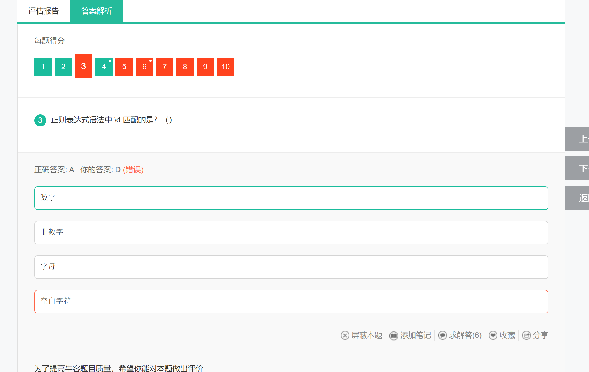

考察对正则表达式的掌握，此题不会，瞎猜的

```
\d      匹配一个数字字符。等价于 [0-9]。
\D     匹配一个非数字字符。等价于 [^0-9]。
\f       匹配一个换页符。等价于 \x0c 和 \cL。
\n      匹配一个换行符。等价于 \x0a 和 \cJ。
\r       匹配一个回车符。等价于 \x0d 和 \cM。
\s      匹配任何空白字符，包括空格、制表符、换页符等等。等价于 [ \f\n\r\t\v]。
\S      匹配任何非空白字符。等价于 [^ \f\n\r\t\v]。
\t       匹配一个制表符。等价于 \x09 和 \cI。
\v      匹配一个垂直制表符。等价于 \x0b 和 \cK。
\w     匹配字母、数字、下划线。等价于'[A-Za-z0-9_]'。
\W    匹配非字母、数字、下划线。等价于 '[^A-Za-z0-9_]'。
```


------


#### Java封装Socket

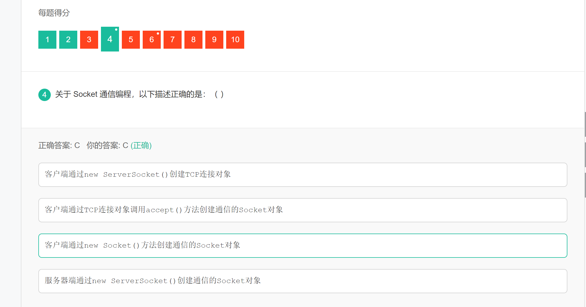


Java封装socket，未使用过，瞎猜的

```
客户端通过new Socket()方法创建通信的Socket对象
服务器端通过new ServerSocket()创建TCP连接对象  accept接纳客户端请求
```


-------


#### volatile关键字

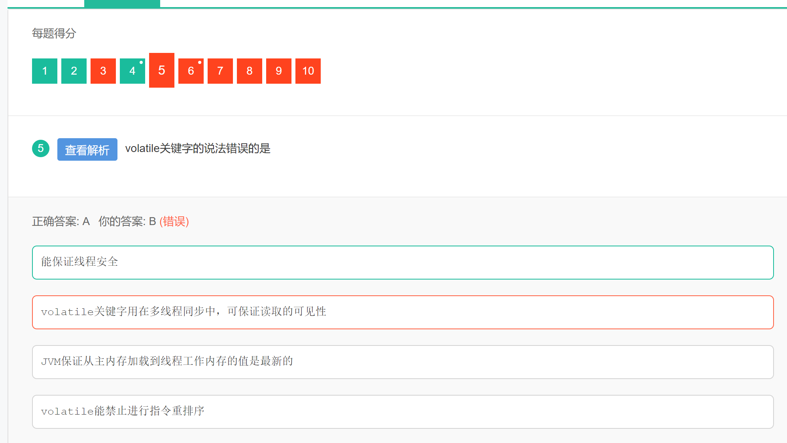

```
出于运行速率的考虑，java编译器会把经常经常访问的变量放到缓存（严格讲应该是工作内存）中，读取变量则从缓存中读。但是在多线程编程中,内存中的值和缓存中的值可能会出现不一致。volatile用于限定变量只能从内存中读取，保证对所有线程而言，值都是一致的。但是volatile不能保证原子性，也就不能保证线程安全
```


#### Thread线程类方法

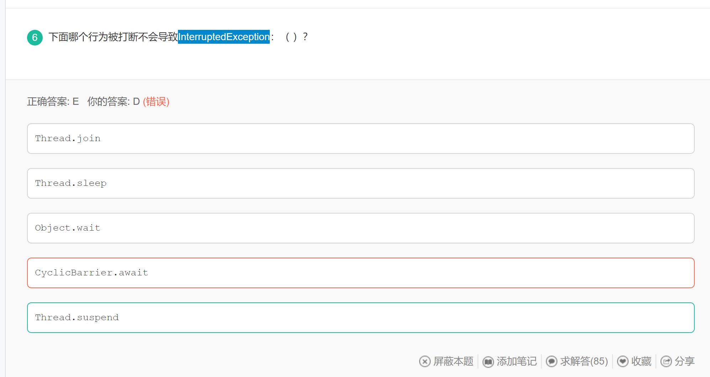

审题：哪种行为被打断时，会导致触发该异常

```
API里面写的：当线程在活动之前或活动期间处于正在等待、休眠或占用状态且该线程被中断时，抛出该异常。


D答案我看没有说明，我简单说一下，CyclicBarrier是一个屏障类，它的await方法可以简单的理解为：等待多个线程同时到达之后才能继续进行，在此之前它就是这些线程的屏障，线程不能继续进行，而对于失败的同步尝试，CyclicBarrier 使用了一种要么全部要么全不 (all-or-none) 的破坏模式：如果因为中断、失败或者超时等原因，导致线程过早地离开了屏障点，那么在该屏障点等待的其他所有线程也将通过 BrokenBarrierException（如果它们几乎同时被中断，则用 interruptedException）以反常的方式离开。因此它被中断也是可以抛出interruptedException的，如果还是不清楚，查看一下JavaAPI，对于这个类介绍的清清楚楚。

E选项表示中断暂停，线程被暂停
```


#### 创建对象的几种方式

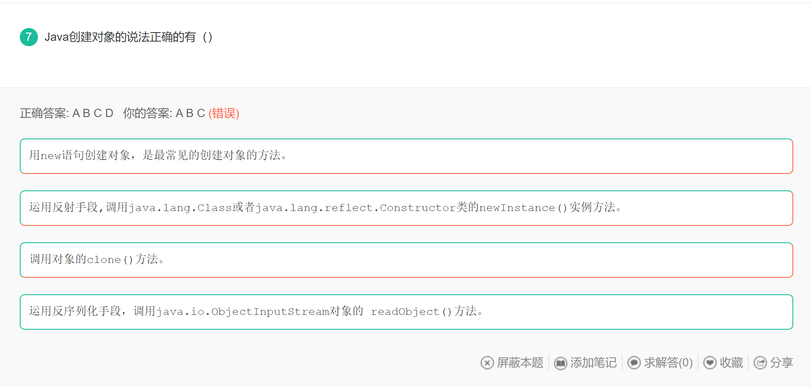


```
Java有5种方式来创建对象： 1、使用 new 关键字（最常用）： ObjectName obj = new ObjectName(); 2、使用反射的Class类的newInstance()方法： ObjectName obj = ObjectName.class.newInstance(); 3、使用反射的Constructor类的newInstance()方法： ObjectName obj = ObjectName.class.getConstructor.newInstance(); 4、使用对象克隆clone()方法： ObjectName obj = obj.clone(); 5、使用反序列化（ObjectInputStream）的readObject()方法： try (ObjectInputStream ois = new ObjectInputStream(new FileInputStream(FILE_NAME))) { ObjectName obj = ois.readObject(); }
```


#### 抽象类与接口

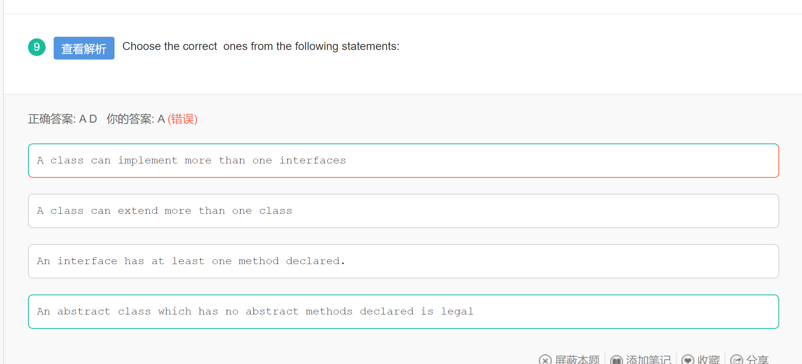

抽象类可以不包含抽象方法，但是有抽象方法的类一定是抽象类

```
1、一个类可以有多个接口；
2、一个类只能继承一个父类；
3、接口中可以不声明任何方法，和成员变量
interface testinterface{
	
}
4、抽象类可以不包含抽象方法，但有抽象方法的类一定要声明为抽象类
 abstract class abstclass{
	abstract void meth();
}
```


#### Java关键字

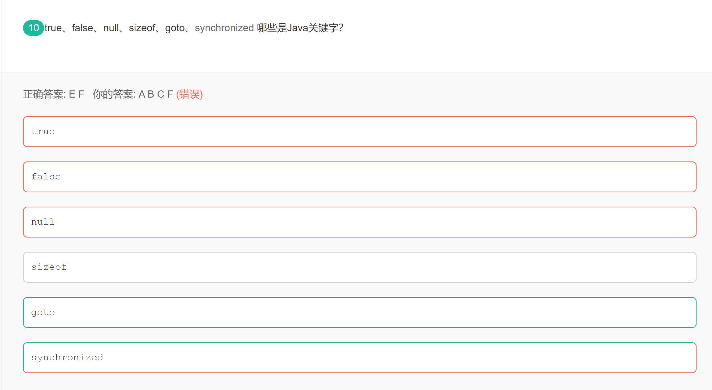

以下图片为答案截图

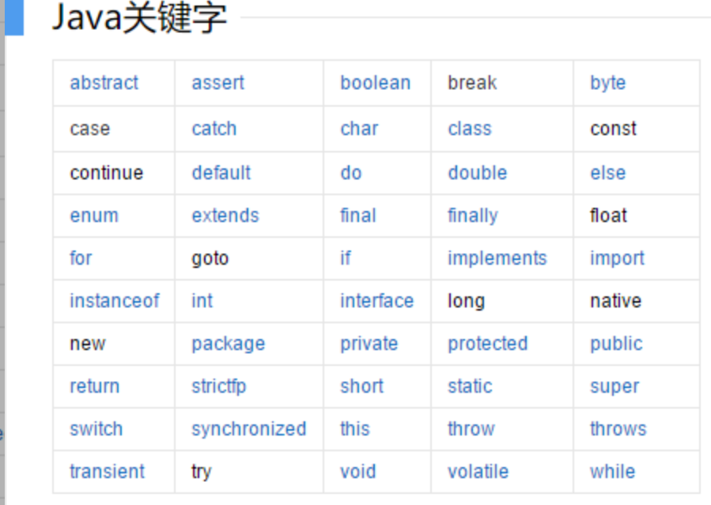

```
goto和const是保留字也是关键字。
1，Java 关键字列表 (依字母排序 共50组)：
abstract, assert, boolean, break, byte, case, catch, char, class, const（保留关键字）, continue, default, do, double, else, enum, extends, final, finally, float, for, goto（保留关键字）, if, implements, import, instanceof, int, interface, long, native, new, package, private, protected, public, return, short, static, strictfp, super, switch, synchronized, this, throw, throws, transient, try, void, volatile, while
2，保留字列表 (依字母排序 共14组)，Java保留字是指现有Java版本尚未使用，但以后版本可能会作为关键字使用：
byValue, cast, false, future, generic, inner, operator, outer, rest, true, var, goto （保留关键字） , const （保留关键字） , null
```


### 第三天(6月29) md，这么久才更新

#### Log4J

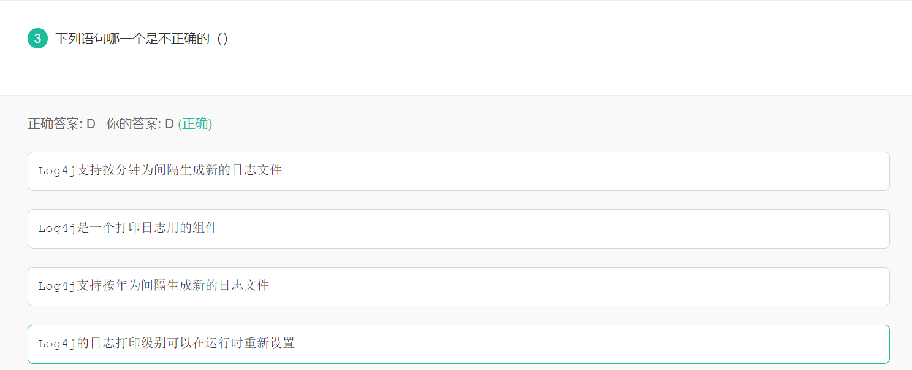

日志的级别之间的大小关系如右所示：ALL < TRACE < DEBUG < INFO < WARN < ERROR < FATAL < OFF Log4j建议只使用四个级别，优先级从高到低分别是 ERROR > WARN > INFO > DEBUG。 log4j在运行期间是不可以重新设置的


#### Java基础

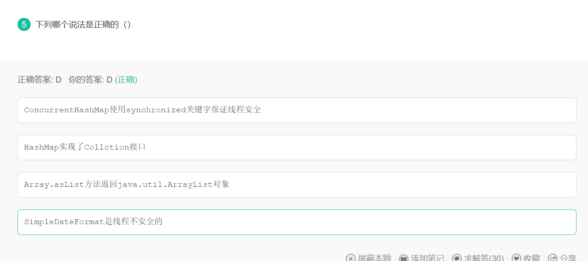


A选项中，ConcurrentHashMap 使用segment来分段和管理锁，segment继承自ReentrantLock，因此ConcurrentHashMap使用ReentrantLock来保证线程安全；

B中，HashMap定义规则如下：

```java
public class HashMap<K,V>
    extends AbstractMap<K,V>
    implements Map<K,V>, Cloneable, Serializable
```

C中，应该是Arrays.asList()，其将一个数组转化为一个List对象，这个方法返回一个ArrayList类型的对象，  这个ArrayList类并非java.util.ArrayList类，而是Arrays类的内部类；

D选项中

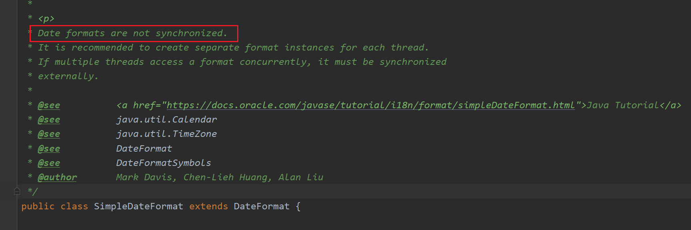


#### Java

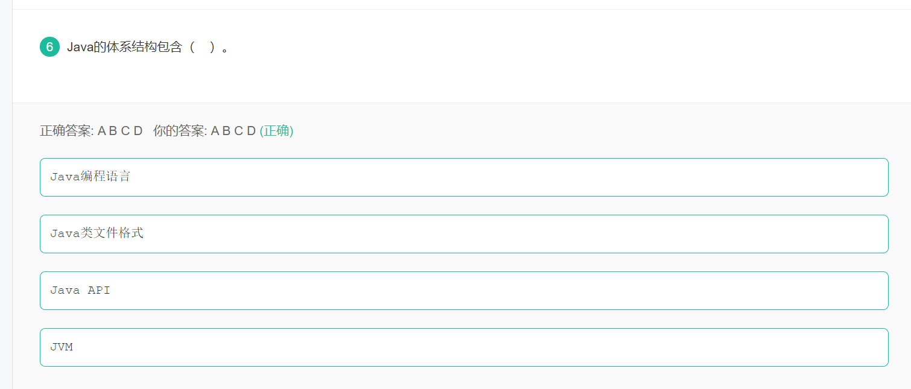

Java体系结构包括四个独立但相关的技术：

- Java程序设计语言
- Java.class文件格式
- Java应用编程接口（API）
- Java虚拟机

我们再在看一下它们四者的关系：

  当我们编写并运行一个Java程序时，就同时运用了这四种技术，用**Java程序设计语言**编写源代码，把它编译成**Java.class文件格式**，然后再在**Java虚拟机中运行class文件**。当程序运行的时候， 它通过调用class文件实现了**Java API的方法**来满足程序的Java API调用


#### Java继承

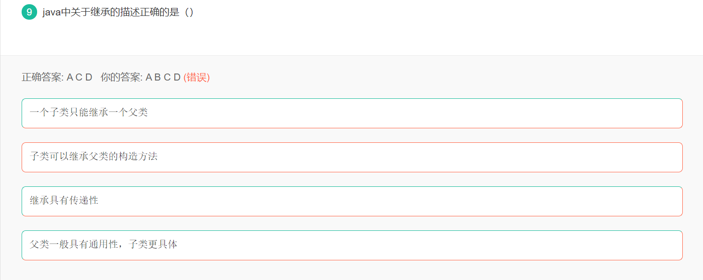

子类不可以继承父类的构造方法，只可以调用父类的构造方法。子类中所有的构造函数都会默认访问父类中的空参数构造函数，这是因为子类的构造函数内第一行都有默认的super（）语句。super（）表示子类在初始化时调用父类的空参数的构造函数来完成初始化。一个类都会有默认的空参数的构造函数，若指定了带参构造函数，那么默认的空参数的构造函数，就不存在了。这时如果子类的构造函数有默认的super（）语句，那么就会出现错误，因为父类中没有空参数的构造函数。因此，在子类中默认super（）语句，在父类中无对应的构造函数，必须在子类的构造函数中通过this或super（参数）指定要访问的父类中的构造函数。


#### 异常机制

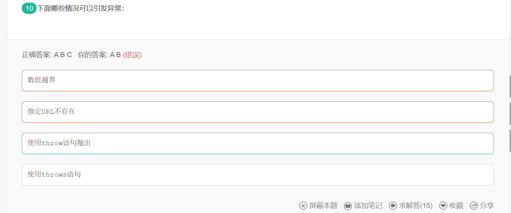


throws出现在方法头，throw出现在方法体 2、throws表示出现异常的一种可能性，并不一定会发生异常；throw则是抛出了异常，执行throw则一定抛出了某种异常。 3、两者都是消极的异常处理方式，只是抛出或者可能抛出异常，是不会由函数处理，真正的处理异常由它的上层调用处理。


### 第三天(7.4更新)

#### switch语法

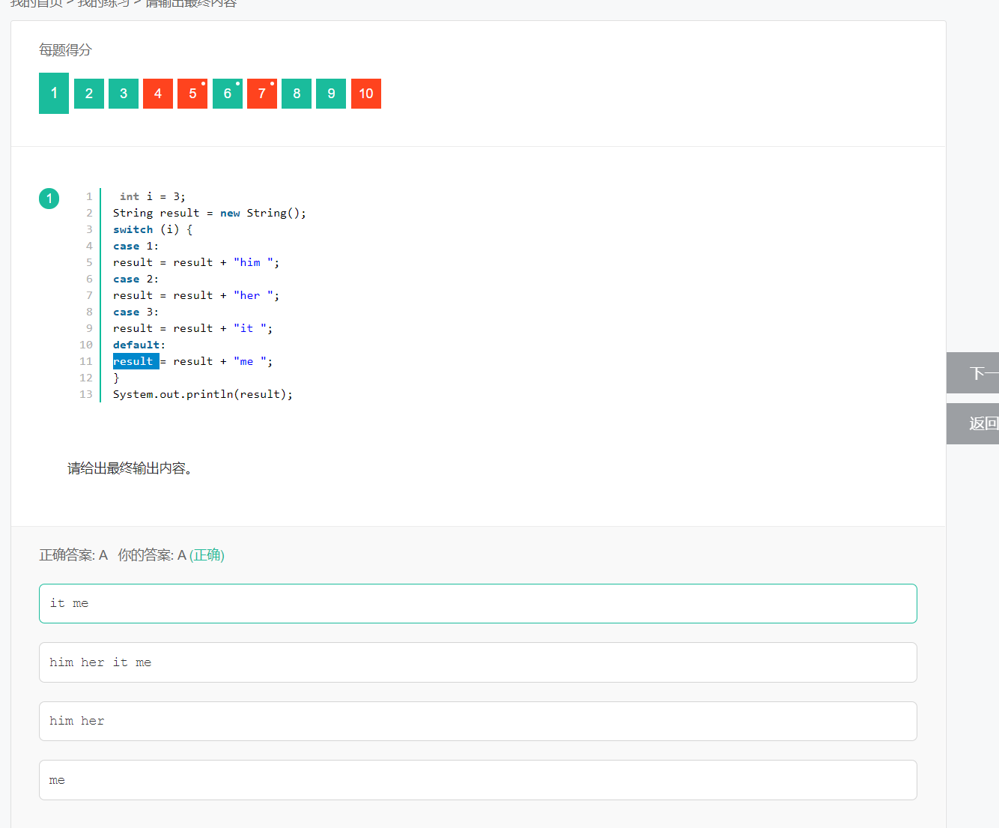


这一题乍看很简单，自己当时认为是case 3 执行，default语句默认执行，实际理解有误。

1. 如果 case 语句块中没有 break 语句时，匹配成功后，从当前 case 开始，后续所有 case 的值都会输出，包括default的值
2. 如果每一个case语句中包含了break语句，default 在没有 case 语句的值和变量值相等的时候执行。default 分支不需要 break 语句。


#### 变量

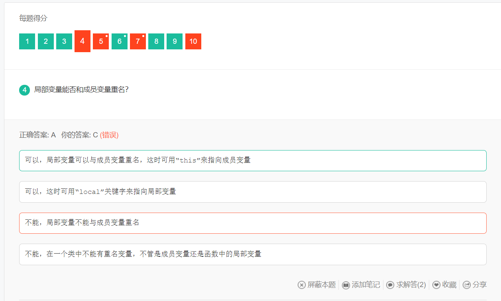


JAVA访问变量采用就近原则，局部变量与成员变量重名时，局部变量比较近，使用局部变量，但是可以使用this来引用成员变量


#### hibernate核心接口

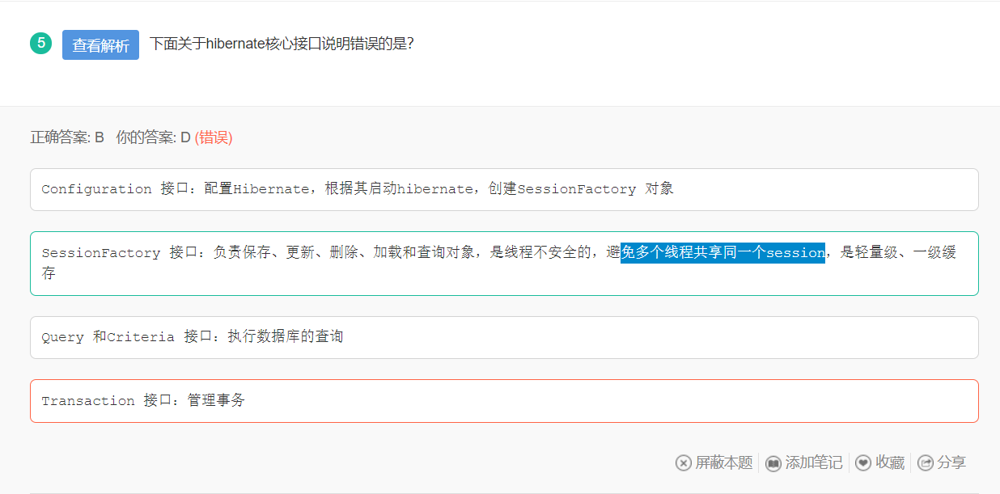


### 第四天(7.5日题目)

#### 基本数据类型数组

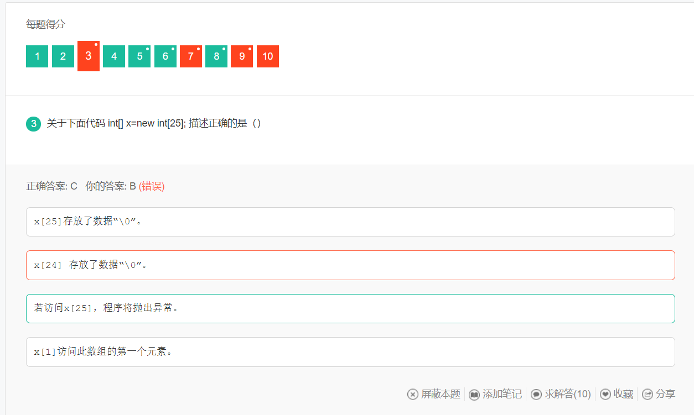

基本数据类型数组的默认值问题，本体没有明白 \0 的含义。

\0  是ASCII码的“0”这个文字对应的代码，也就是48 ；C语言字符串结束符。

所以问题显而易见，为啥没选C 估计是脑子抽了


#### Integer 与 int

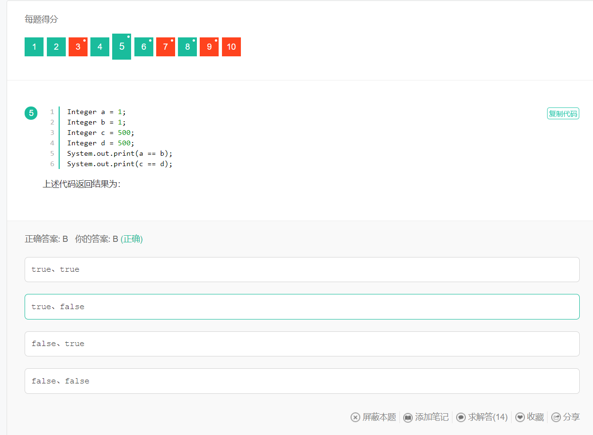

Integer 类型范围在 [-128,127] 范围之间的值是被缓存了的，所以在这个范围内声明的 integer 变量会从缓存中取值，所以地址是相同的；不在这个范围内的，将重新创建一个integer对象出来，地址就不同了


### This关键字

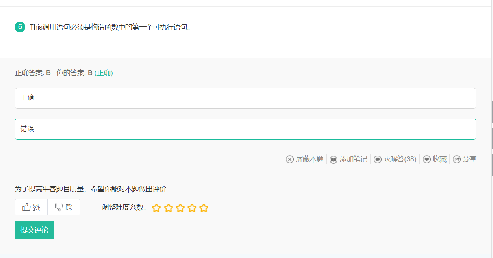

1. 构造器中第一行默认是super()，一旦直接父类的构造器中没有无参的，那么必须显式调用父类的某个有参构造。
2. 构造器中第一行的super()可以换成this()，但是this()和super()只能出现一个。
3. super，this关键字与super()，this()不是一回事，前者表示当前调用者的父类与其本身，后者是为了构造器相互调用。


### 多态

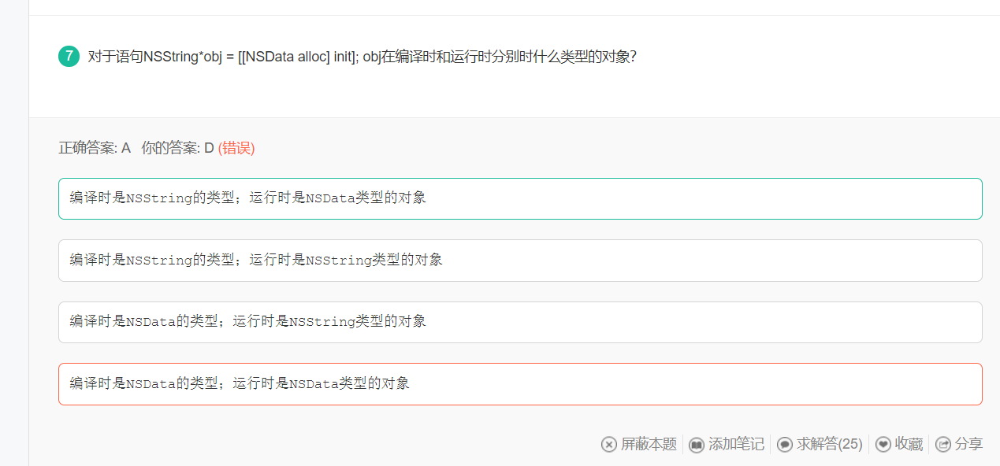

没看懂题目中声明的表达式。

其实是为了考察多态的一些基本概念，比如运行时才知道具体的对象类型


### Java继承&语法

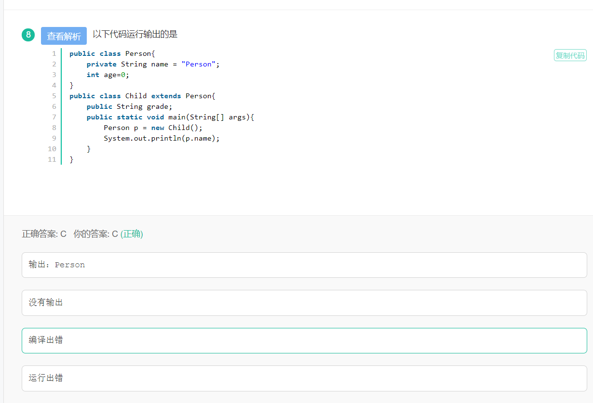

1. 子类继承父类，继承了父类的所有成员，包括private修饰的成员变量，但是继承的子类具有私有变量的拥有权，但是没有使用权
2. private的成员变量，只能在类的内部使用，即便是子类，也不能访问


### 线程异常

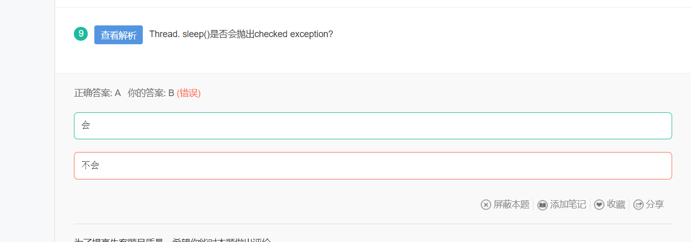