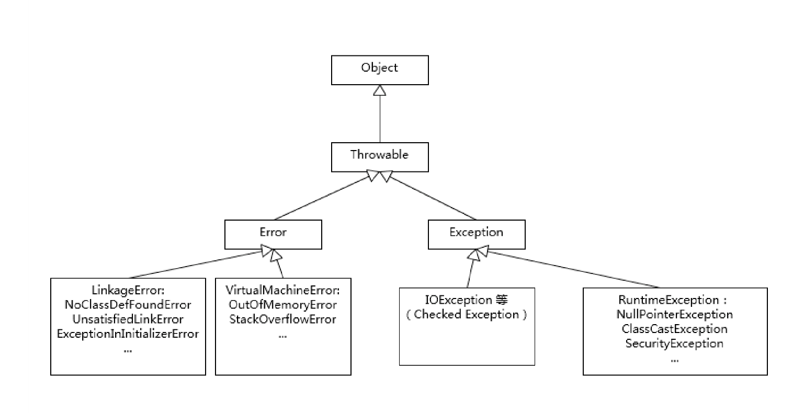

## 1讲 谈谈你对Java平台的理解

**典型回答**

Java本身是一种面向对象的语言，最显著的特点有两个方面，一个是所谓的书写一次，到处运行，也即 write once，run anywhere ，能够非常容易的获得跨平台的特点，另外就是垃圾收集（GC，garbage collection），Java通过垃圾收集器（garbage collector）回收分配内存，大部分情况下，程序员不需要自己操心内存的分配和回收。

JRE 是Java的运行环境，包含JVM和Java类库，以及一些模块等；JDK可以看成是JRE的一个超集，，提供了更多的工具，比如编译器javac，各种诊断工具等

对于Java是解释执行这句话是不太准确的，我们开发的Java的源代码，首先通过Javac编译成字节码，然后在运行的时候，通过Java虚拟机JVM内嵌的解释器将字节码转换为最终的机器码。但是常见的JVM，比如大多数情况下使用的oracle JDK提供的Hotspot JVM，都提供了JIT(just-in-time)编译器，也就是常见的动态编译器，JIT能够在运行的时候将热点代码编译成机器吗，这种情况下热点代码就是编译执行了，而不是解释执行。

区分编译执行和解释执行：

1. 编译执行：编译器讲源程序的每一条语句都编译成机器语言，并保存成二进制的文件，翻译和执行是分开的，这样计算机就可以直接运行编译后的文件，例如c ，c++都是靠编译实现的
2. 解释执行：在执行程序的时候，通过解释器解释成机器能够识别的机器语言，翻译与执行是一次性完成的，例如Java的解释执行其实是先将Java文件编译成class文件，然后再程序执行的时候，由JVM内嵌的解释器将字节码转换为最终的机器码，然后再去执行；

JIT编译器负责将热点代码在运行的时候编译成机器码并且保存下来，减少解释执行的时间开销，从而达到提高效率的目的。


对于该问题的回答应该是宽泛的，从Java语言的特点，平台的优缺点，jdk，jre，jvm相关的内容，都可以去说。但是宽泛的问题容易给自己挖坑。


## 2讲 Exception和Error有什么区别

**典型回答**

Exception和Error都继承了Throwable类，在Java中只有Throwable类型的实例才可以被抛出（throw）活着不活（catch），它是异常处理机制的基本组成类型。

Exception和Error体现了Java平台设计者对于不同异常的分类，Exception是程序正常运行中，可以预料到的意外情况，可能并且应该被捕获，进行相应的处理

Error是指在正常的情况下，不大可能出现的情况，绝大多数的Error都会导致程序比如JVM本身处于非正常的不可恢复的，所以不方便捕获也不需要补货，常见的必入outOfmemoryError等，都是Error的子类。

Exception又分为可检查（checked）异常和不检查（unchecked）异常，可检查异常在源代码中必须显示的进行捕获处理，这是编译期检查的一部分，前面我介绍的不可检查Error，是Throwable不是Exception

不检查异常就是所谓的运行时异常，类似的Null Pointer Exception、Array IndexOutOfBounds Exception之类，通常是可以通过编码避免的逻辑错误，具体根据需要来判断是否需要捕获，并不会做编译器强制要求。


**考点分析**

一、理解Throwable、Exception、Error的设计和分类，比如掌握那些应用最为广泛的子类，以及如何自定义异常，其实就是异常的分类



例如：NoClassDefFoundError和ClassNotFoundException有什么区别

1. 首先NoClassDefFoundError是Error的子类，ClassNotFoundException是Exception的子类

**ClassNotFoundException：**

当使用类加载器的加载某个类的时候，发现所有的path下面都没有找到，从引导类路径，扩展类路径到当前的classpath下都没有找到，就会抛出ClassNotFoundException异常，比如，加载JDBC驱动包的时候，以来的jar包不在classpath下，就会抛出该异常。

执行以下方法的时候容易抛出这些异常

```java
Class.forName()
ClassLoader.loadClass()
ClassLoader.findSystemClass()
```


**NoClassDefFoundError**

1. 编译的时候存在的某个类，但是运行的时候却找不到了

```Java
public class A {
 
    public void hello(){
 
        System.out.println("A hello");
    }
 
}
 
 class B {
 
     public static void main(String[] args) {
 
         A a=new A();
 
     }
 
}
```

上面的Java类编译后产生两个类文件，一个A.class，一个B.class，如果在编译后删除了A的class文件，然后直接执行B的main方法，就会抛出NoClassDefFoundError错误，因为当执行到 A a=new A()；这一步的时候，jvm认为这个类肯定在当前的classpath里面的，要不然编译都不会通过，更不用提执行了。所以直接抛出error，认为这个问题很严重

2. 类初始化失败，还继续使用这个类，也会导致报该错误

```java
//声明类
public class  Loading {
 
    static double i=1/0;//故意使得类初始化失败.
 
    public static void print(){
 
        System.out.println("123");
    }
 
}

//使用类
public static void main(String[] args) {
 
        try {
            double i=Loading.i;
        }catch (Throwable e){
        //此处，必须用Throwable，用Exception会直接退出.
            System.out.println(e);
        }
        //继续使用.
        Loading.print();
 
 
    }
    


```

报错如下

```java
Exception in thread "main" java.lang.NoClassDefFoundError: Could not initialize class class_loader.exception.Loading
java.lang.ExceptionInInitializerError
    at class_loader.exception.NoClassFoundErrorTest.main(NoClassFoundErrorTest.java:18)
    at sun.reflect.NativeMethodAccessorImpl.invoke0(Native Method)
    at sun.reflect.NativeMethodAccessorImpl.invoke(NativeMethodAccessorImpl.java:62)
    at sun.reflect.DelegatingMethodAccessorImpl.invoke(DelegatingMethodAccessorImpl.java:43)
    at java.lang.reflect.Method.invoke(Method.java:498)

```

**总结**

1. 当使用反射或者类加载器的loadClass方法去动态的加载一个所有classpath里面都不存在的类，类加载器中运行时的load阶段就会直接抛出ClassNotFoundException异常。另外jvm认为这个异常是可以被预知的需要提前被check。
2. 在编译时期正常，但是在运行时执行new关键词的时候，发现依赖类找不到，或者对于初始化失败的一个类，再次访问其境台成员或者方法，会直接抛出NoClassDefFoundError
3. 前者侧重在类加载器加载阶段找不到类信息，后者侧重在使用阶段出现问题比如实例化依赖类找不到或者类本身就初始化失败了


二、理解Java语言中操作Throwable的元素和实践

try-catch-finally：

注意只有finally对应的try块代码被执行了，finally里面的代码才会被执行

throw：在代码中抛出一个异常

throws：throws是方法可能抛出异常的声明


## 3讲 谈谈final、finally、finalize有什么不同

其实从含义来说，他们没有什么联系，只不过长得差不多罢了，那就一个一个来说吧

**典型回答**

final可以用来修饰类、方法、变量，final修饰类的时候表示这个类不可以被继承，final修饰的变量表示变量的引用不可以被修改，final修饰的方法表示该方法不可被重写。

finally是java保证代码一定执行的一种机制。我们可以使用try- finally或者try- catch- finally来进行一些资源关闭的一些操作，如关闭JDB C链接，保证unlock锁等动作。

finalize锁基础类java.lang.Object的一个方法，设计目的是为了保证对象在垃圾收集前完成特定资源的回收。finalize机制现在已经不推荐使用了，jdk9已经标记为deprecated。

**考点分析**

**final**

- 将方法或者类声明为final，不允许别人修改

Java核心类库或者一些第三方基础库中，有一些类就被声明为了final class，表示不能被修改，从某种程度上保证了平台的安全性。例如我们所熟悉的String类就是被声明为了final。

- 使用final修改参数或者变量，可以防止意外赋值
- final中产生了某种程度的不可变(immutable)的效果，可以保护只读数据。


**finally**

保证代码一定可以被执行。

下面的代码中，由于try语句总直接退出程序了，所以finally代码块不会被执行。

```
try {
 // do something
 Sysem.exit(1);
} fnally{
 Sysem.out.println(“Print from fnally”);
}
```

如果使用finally来进行资源关闭或者回收操作，更推荐使用Java7中的try-with-resources语句。

try-with-resources语句是一种声明了一种或多种资源的try语句。资源是指在程序用完了之后必须要关闭的对象。try-with-resources语句保证了每个声明了的资源在语句结束的时候都会被关闭。任何实现了java.lang.AutoCloseable接口的对象，和实现了java.io.Closeable接口的对象，都可以当做资源使用。


**finalize**

对于finalize，我们要明确不推荐使用，因为无法保证重写的finalize什么时候执行，执行的是否符合预期，使用不当会影响性能，导致程序死锁，挂起。


**知识扩展**

1. final不是immutable

final不等同于不可变，final修饰的变量，只是表示该变量不可以再被赋值，但是这个变量所指向的对象的行为不受影响。如果希望一个对象本身所不可变的，那么需要对这个对象所属的类的行为进行约束：

- 将class声明为final
- 将所有的成员变量声明为private，final
- 构造对象的时候，成员变量采用**深度拷贝**来初始化，而不是直接赋值，因为你无法确定输入的对象不被其他人修改
- 如果需要实现getter方法，或者其他的需要返回类内部的方法，使用copy-on-write原则，创建私有的copy。


2. finalize为什么不推荐使用

finalize的执行上和垃圾收集关联在一起的，一旦实现了非空的finalize，就会导致相应的对象回收呈现数量级的变慢。因为finalize被设计为中对象垃圾收集前调用，这就意味着实现了finalize方法的对象，JVM在对其进行垃圾回收时需要进行一些额外处理。finalize本质上称为了快速的回收的阻碍者，可能导致对象经过多个垃圾回收周期才能被回收。拖慢垃圾回收，导致大量对象堆积，会导致OOM。


3. 有什么机制可以有效替代finalize

Java平台目前逐步使用java.lang.ref.Cleaner来替换原有的finalize实现。Cleaner的实现利用了幻象引用，这是一种常见的所谓**post-mortem清理机制**，利用幻象引用，保证对象被彻底销毁前做一些类似的资源回收工作，比如关闭文件描述符，它比finalize更加轻量，更加可靠。

Cleaner机制也有其局限性，如果由于一些原因导致幻象引用堆积，同样会导致OOM的问题。


## 4讲 强引用、软引用、弱引用、幻象引用有什么区别？具体使用场景是什么？


什么是对象可达性？

几个引用的解释没看太懂，需要翻书确认一下

内存泄漏


 


