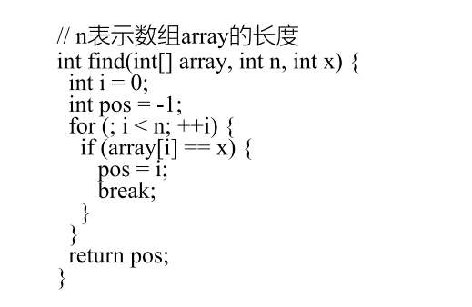
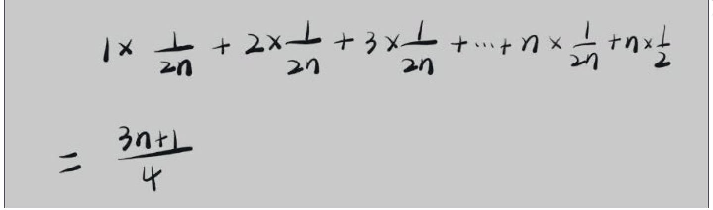
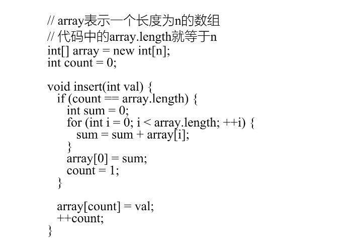
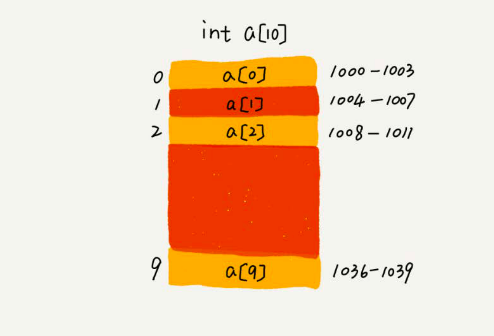
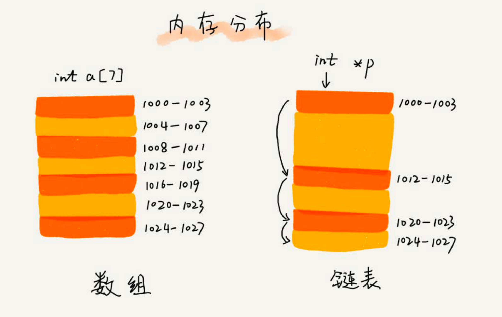
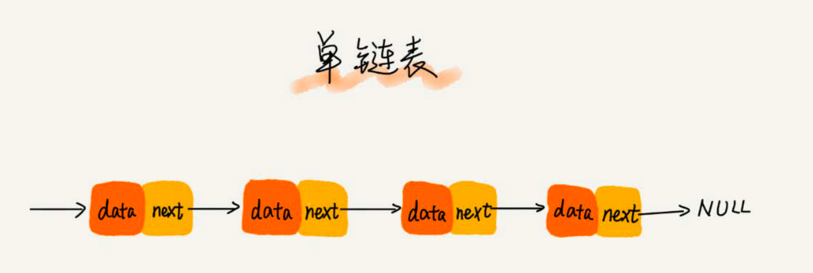
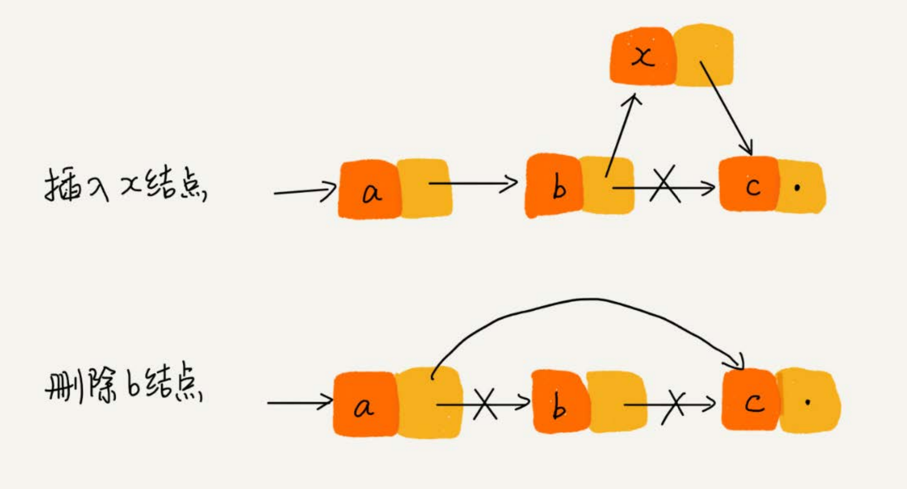
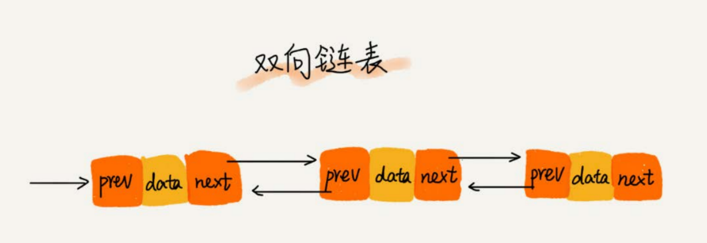
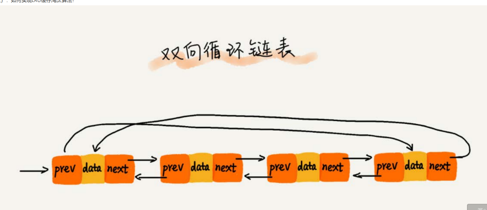
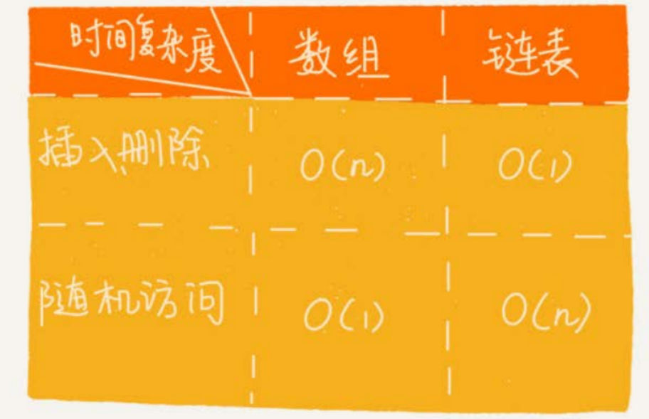

## 01,02如何抓住重点，系统高效的学习数据结构与算法

适度刷题，掌握课程中的20个数据结构与算法


## 02复杂度分析：如何分析、统计算法的执行效率和资源消耗

**事后统计法**

1. 测试环境
2. 测试数据规模

**时间空间复杂度分析方法**

时间复杂度和空间复杂度都是用来衡量算法的执行效率的，都是用来表征**算法执行效率和数据规模**之间的关系的


## 03复杂度分析：浅析最好、最坏、平均、均摊时间复杂度

**最好**、**最坏时间复杂度**



这段代码，循环中当找到目标元素后直接终止了循环，此时可能存在多种情况，最好的情况就会第一个元素就找到了，那么此时的时间复杂度就是O(1)；最坏的情况下，如果数组中不包含该元素，则时间复杂度为O(n)。

由此引出最好、最坏、平均时间复杂度

**最好时间复杂度**

在最理想的情况下，执行代码的时间复杂度


**最坏时间复杂度**

在最坏的情况下，执行代码的时间复杂度，可以参考上面举的例子


**平均时间复杂度**

对于最好和最坏时间复杂度，都是比较极端的情况才会产生的，发生的概率并不大，为了更好的表示平均情况下的时间复杂度，引入平均时间复杂度的概念。

1. 简单计算的方法

首先变量x在数组中的位置有n+1中情况：在数组的0～ n-1的位置和不在数组中，我们把每种情况下，查找x需要遍历的元素个数累加起来，然后再处以n+1 ，就可以得到需要遍历的元素个数的平均值了


最后由上面的共识，省略掉低阶和常数项，最终得到的平均时间复杂度是O(n)


2. 加上概率统计的计算方法

1中的方法统计是有问题的，因为并不是每种情况出现的概率都是一样的，如果出现的概率不一样，则需要将概率统计相关的内容加进去。

我们要查找的元素，它在数组中和不在数组中的概率都是1/2，另外，要查找的数据出现在0～n-1这n个位置的概率也是一样的，为1/n，根据乘法法则，要查找的数据出现的概率是 1/ (2n)，因此推导的过程中需要将各种情况发生的概率考虑进去。




**均摊时间复杂度**

先上示例代码




以上，将方法入参插入到数组中，最好的情况是数组有空间，则直接插入；最坏的情况是需要遍历一遍后，数组清空后再插入，此时的时间复杂度是O(n)。

对于insert()函数来说，O(1)时间复杂度的插入和O(n)时间复杂度的插入，出现的频率是非常有规律的，而且有一定的前后时序关系，一般都是一个O(n)插入之后，紧跟着n-1个O(1)的插入操作，循环往复。

每一次O(n)的插入操作，都会跟着n-1次O(1)的插入操作，所以把耗时多的那次操作均摊到接下来的n-1次耗时少的

操作上，均摊下来，这一组连续的操作的均摊时间复杂度就是O(1)。

其实以上关于均摊时间复杂度的概念我也是比较迷的，但是老师有说在大多数的情况下，均摊时间复杂度就是最好时间复杂度。


## 05数组：为什么很多编程语言中数组队列都是从0开始编号

**如何实现随机访问？**

1. 数据是线性表结构
2. 数组拥有连续的内存空间和相同的数据结构。

这两点使得数组拥有了随机访问的特性，但是让插入和删除一条记录的效率变的很低。



**为什么说数组的随机访问效率高？**

1. 首先数组拥有连续的内存空间
2. 计算机会给每一个内存空间分配一个地址，计算机通过地址来访问内存中的数据，当计算机需要随机访问数组中的某个元素的时候，通过寻址公式，就可以计算出元素存储的内存地址：

```
a[i]_address = base_address + i * data_type_size
```

其中 i 可以说是我们通常意义上的数组下标，在面试中，我们不能说数组的优点是适合查找，而应该是数组支持按下表来进行随机访问，并且随机访问的时间复杂度是O(1)


**线性表**：线性表就是数据排列成像一条线一样的结构，每个线性表上的数据最多只有钱和后两个方向，除了数组，连标、队列、栈等也是线性表结构

**非线性表**：与线性表相对，数据之间不是简单的前后关系，比如二叉树，堆，图


**低效的 插入 和 删除**

由于数组要保持内存数据的连续性，会导致插入和删除这两个操作比较低效。

**插入**

假设数组有n个元素，当我们要将一个数据插入到数组中的第k个位置，为了把k个位置腾出来，需要将k～n之间的元素都按顺序往后挪一位，我们接下来分析一下这个过程的时间复杂度，如果是中数组末尾追加元素，那么此时的时间复杂度就O(1)，如果是在数组的第一位插入，此时需要挪动的次数为n次，由此计算出来的平均时间复杂度为O(n)。

**如何改进呢？**

如果数组中的数据要求是有序的，那么我们操作数组的时候就需要按照上述描述的，挪动k位置以后的元素。如果数组中的元素是无序的，并且对数据的顺序没有要求，只是将数组作为一个容器，那么可以将k位置的元素放到数组的末尾，然后将新加入的元素放到k位置，从而减少了数组中元素位置移动的次数，提高了插入元素的效率。

利用刚才的方法，时间复杂度就达到了O(1)


**删除**

和新增类似，同样是为了保存数据存储在内存上的连续性，删除位置k的元素，需要将k+1～n的元素向前移动一位。当删除的末尾的元素时，时间复杂度为O(1)，如果删除的开头的元素，则时间复杂度为O(n)。

**如何改进呢**

每次删除通常会伴随着数组中元素位置的变化，我们可以将多次删除的操作集中到一次去做，也就是当数组进行删除操作的时候，先将删除的元素记录下来，而不是真正的去执行删除操作，相当于只是记录了哪些元素被删除了，当数组没有更多空间存储数据的时候，再统一触发一次真正的删除操作。这种思想就是JVM中标记清除垃圾回收算法的核心思想


**容器是否可以替代数组**

很多语言都对数组进行了封装，主要是对数组的一些操作，以及自动扩容等内容进行了封装，方便了业务开发中使用。由于频繁的扩容可能会带来较大的如果性能消耗，所以如果我们知道了容器中需要存储多少数据了，那么可以在创建容器的时候指定容器的大小，避免扩容带来的开销。

**容器和数组的比较**

1. Java的 ArrayList 无法存储基本数据类型，如int，long等数据，如果需要保存基本数据类型，那么需要使用对应包装类，而Autoboxing，Unboxing也会有一定的性能消耗，如果特别关注性能，那么使用数组更方便。
2. 如果数据的大小提前已知了，并且对数据的操作很简单，那么可以直接使用数组本身
3. 如果要表示多维数组的话，使用数组往往更加直观

日常开发中使用容器更好，在性能损失方面很少，可以忽略，而且能够大大提高开发的效率，如果是做一些底层开发，并且对性能要求很高，那么可以使用数组。这个让我想到的springBoot自带的hikaricp数据库连接池，它之所以快，和它很细节的优化分不开，所以我觉得在这些细节之中也是这样要求的。


**为什么大多数编程语言中数组大多是从0开始，而不是从1开始**

**理论原因**

1. 从数组的内存模型来看，下标确切的说可以是偏移量。如果用a来表示一个数组的首地址，a[0]就是偏移量为0 的位置，也就是第一个元素，a[k]也就是偏移量为k时的元素，此时的寻址公式为

2. ```
   a[k]_address = base_address + k * type_size
   ```

   如果我们从1开始计数，那么寻址公式就变成了

   ```
   a[k]_address = base_address + (k-1)*type_size
   ```

对比两个公式，如果从1开始计数的话，每次都需要计算一次减法，对CPU来说就多了一次减法计算，所以从0开始性能更高

**历史原因**

C语言设计者用0开始计数数组的下标，所以之后的Java，js等都是效仿了C语言的，便于C语言开发者上手Java


**课后思考**

1. 前面我基于数组的原理引出JVM的标记清除垃圾回收算法的核心理念。我不知道你是否使用Java语言，理解JVM，如果你熟悉，可以在评论区回顾下你理解的标记清除垃圾回收算法

**标记清楚算法**，标记出所需要回收的对象，标记工作完成之后，才会统一回收被标记的所有对象

1. 效率问题：标记和清除的效率都不高
2. 清除问题：清除后会产生大量不连续的内存碎片，空间碎片太多了，当程序运行中需要分配较大内存给一个较大的对象的时候，没有足够的连续内存，将会不得不提前触发一次垃圾回收动作。

另外几种垃圾回收算法：复制算法、标记整理算法、分代回收算法，这些可以在JVM相关内容在展开记录


2. 二维数组的寻址公式是什么样子的？


## 06链表(上)：如何实现LRU缓存淘汰算法

**缓存淘汰算法**

常用的有三种：新进先出策略FIFO(first in first out)、最少使用策略LFU(Least frequently used)、最近最少使用策略LRU(Least recently used)

首先普及一下缓存淘汰算法，缓存可以提高数据的读写性能，但是缓存的大小有限，当缓存被用满时，哪些数据应该被清除除去，哪些数据应该保留，这就是缓存淘汰策略来定义的。说的缓存淘汰策略我想到了线程池的饱和策略，其实也是类似的思想。

**链表与数组的区别**

1. 创建一个数组需要连续的内存空间，如果需要申请一个100m的数组，但是内存中又没有连续的100m内存空间时，此时创建数组会失败。
2. 链表不需要连续的内存空间，通过指针将一组零散的内存空间串联起来。




**关于链表的一些基本概念**

单链表中每个结点包含数据，以及指向下一个结点地址的指针next，其中第一个结点一般称为头结点，最后一个结点称为尾结点。


**单链表**

单链表中，头结点用来记录链表的基地址，尾结点的后继指针指向为null，表示这是链表的最后一个指针。




**新增和删除 :** 相比较数组，数组在进行删除与添加的操作时，为了保证内存空间的连续性，需要做大量的数据搬移的操作，时间复杂度为O(n)。而在链表中对一个结点的删除与新增操作不需要对数据进行搬移的操作，因为从内存空间上看，链表本身存储不是连续的，所以效率更高。

**查询：**链表查询第k个元素的时候，必须要从头结点开始遍历，一个一个的往下找，时间复杂度为O(n)。





**循环链表**

循环链表是一种特殊的单链表，和单链表的区别就在于尾结点的后继指针指向的是链表的头结点。




**双向链表**

双向链表中，有两个指针，分别是前驱指针和后继指针，分别指向当前结点的前一个结点和后一个结点，由于多出了一个指针，存储相同数据量的数据时，双向链表比单向链表要占用更多的空间。

从结构上看，双向链表查找前驱结点的时间复杂度为O(1)。由此，相比较于单链表，删除一个结点或者新增一个结点的效率也跟高。

删除操作可分为：

1. 删除结点中 值等于某个给定值 的结点
2. 删除指定指针指向的某个结点

对于第一种情况，无论是单向链表还是双向链表，都需要从头开始遍历，找到对应值的结点，然后通过指针的变换来完成删除操作。

但是尽管删除操作的时间复杂度是O(1)，但遍历查找的时间是主要的消耗点，对应的时间复杂度是O(n)。根据时间复杂度的加法规则，删除 值等于给定某个值  的结点的时间复杂度就是O(n)。

对于第二种情况，我们已经知道了指定结点的地址，但是链表删除某个结点q的时候，需要知道这个结点的前驱结点，而单链表并不支持直接获取当前结点的前驱结点，所以，为了找到这个前驱结点，又需要从头来查找前驱结点，这种情况下，时间复杂度就变成了O(n)。而双向链表则可以在时间复杂度为O(1)内完成该操作。

同理，如果我们需要在某个结点前面插入一个结点，单向链表也是需要从头开始遍历到当前结点的前一个结点，然后再变换指针，时间复杂度为O(n)。而双向链表可以在时间复杂度为O(1)内操作完成。

对于一个有序列表，双向链表的查询速度也是要比单向链表快的，因为可以记录上次查找到的位置P，每次查询的时候，根据要查找的值与P之间的关系，就是决定是往后查找还是往前查找了，所以平均来说只需要查找一半的数据。

在Java中，LinkedList，LinkedHashMap的底层就是用双向链表实现的。

在双向链表这个数据结构中，可以体现出用空间换时间的思想，因为双向链表相较于单向链表，虽然多出了一个前驱指针，但是提高了查询、插入、删除的效率，所以当内存充足的时候，用双向链表能够提高程序的效率。缓存实际上就是空间换时间的思想，如果数据都存储在硬盘上，虽然比较节省内存，但是每次查询数据都需要询问一次硬盘，速度比较慢，如果数据加载到内存中，虽然比较耗费内存空间，但是数据的查询速度就大大的提高了。


**双向循环链表**



**总结**

比较几个数据结构的特点，对于执行较慢的程序，可以通过消耗更多的内存来进行优化；而消耗内存比较多的程序，可以通过消耗更多的时间来降低内存的消耗。


**链表和数组的比较**



实际的使用中，不能局限于时间复杂度，而是要根据实际场景来区分。

**数组：**

数组简单易用，需要依赖连续的内存空间，可以借助**CPU的缓存机制**，预读数组中的数据，所以访问效率更高。

**CPU的缓存机制:** CPU从内存中读取数据的时候并不是只读那个特定要访问的地址，而是读取一个数据块保存到CPU缓存中，然后下次访问内存数据的时候优先从CPU缓存中查找，这样就可以实现比内存更快的访问机制。

数组声明后大小是确定的，并且会占用整块连续的内存空间，如果内存声明过大，系统中如果没有足够的内存空间，则会导致内存不足(out of memory)。如果声明的数组国小，则可能出现不够用的情况，此时就会涉及到数组的扩容问题，需要创建一个新的数组，然后把原数组拷贝进去，非常耗时。

数组不需要保存指针信息，所以占用的内存空间更小


**链表：**

链表在内存中不是连续存储的，对CPU缓存不太友好，没有办法有效预读。

链表本身没有大小的现值，天然的支持扩容，只要内存中还有空间就行。

链表需要额外保存指针信息，并且如果对链表进行频繁的插入和删除操作，还会对导致频繁的内存申请和释放，容易造成内存碎片，如果是Java语言，可能会频繁的导致GC。


**解答标题：如何用链表实现一个LRU缓存淘汰算法**

LRU算法，最近最少使用，可以维护一个有序链表，越靠近链表尾部表示越早之前访问的，当一个数据被访问的时候，先从链表的头部开始遍历：

1. 如果链表中有该数据，则将该数据位于的结点删除，并且再将这条数据插入到链表的头部
2. 链表中没有该数据
   1. 链表中未存满，则可以直接插入到链表的头部
   2. 链表中已存满，则可以删除掉链表尾部的元素，再将该条数据插入到链表的头部

该算法的时间复杂度是O(n)


**思考题**

如何判断一个字符串是否是回文字符串的问题，我想你应该听过，我们今天的思题目就是基于这个问题的改造版本。如果字符串是通过单链表来存储的，那该如何来判断是一个回文串呢？你有什么好的解决思路呢？相应的时间空间复杂度又是多少呢？

解决：快慢指针，还未学习	


## 07链表(下)：如何轻松写出正确的链表代码

链表相关的题目都是比较复杂的，并且如果链表的题目和指针混合在一起就会显得更加复杂。


**理解指针或引用的含义**

在C语言中的指针以及Java等语言中的引用都是同一个含义。

当我们将某个变量赋值给指针的时候，实际上就是将这个变量的地址赋值给了指针；指针中存储了这个变量的内存地址，通过指针就可以找到这个变量。

我的理解指针或者说引用存储了变量的地址。


### **警惕指针丢失和内存泄露**


