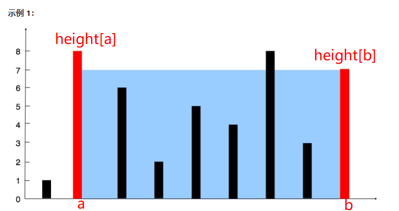

## 01 数据结构与算法总览

### 如何精通一个领域

1. 切碎知识点
   1. 将知识点整理成一个树
   2. 归纳知识脉络
2. 刻意练习
   1. 多次练题，重复练题
   2. **五遍刷题法**
3. 反馈
   1. 及时反馈
   2. 主动反馈(自己去找，比如看别人的题解)
   3. 被动式反馈(别人给你指点)


#### 切题四件套

1. 自己多看几次题目，和面试官多确认几次，确保对题目的理解是正确的
2. 想出所有可能的解法，比较不同解法的时间空间复杂度，找出最优方法
3. 开始写代码
4. 写出一些测试样例


#### 五遍刷题法

##### 第一遍

5-15分钟读题和自主思考

没有思路则直接看解法，比较多种解法之间的优劣以及差别；如果有思路了则直接写出来，然后进行背诵和默写解法，可以先把想到的思路列出来。

 注意一定要去LeetCode国际站的discuss区看看各个国家的解法，至少是要了解一下点赞前三的解法。


##### 第二遍

马上自己写一次，也要尝试多种解法，比较优劣


##### 第三遍

过了一天之后，再重复做一次该题；训练不同解法的熟练程度


##### 第四遍

一周之后重复做题


##### 第五遍

面试前恢复性训练，重复做题


### 优化思想

升维思想；用空间换时间


## 02训练准备和复杂度分析

### 自顶向下的编程方式

1. 先确定编程的主体框架
2. 根据主题框架来编码，将细接类的代码隐藏


### 时间空间复杂度

#### 递归的复杂度计算

1. 把递归的执行顺序画出一个树形结构，如用递归的方式求斐波拉契数列，可以列举出某一项开始计算的递归树
2. 主定理
   1. 二分查找：O(logn)
   2. 二叉树：O(n)
   3. 排序的二维矩阵查找：O(n)
   4. 归并排序：O(nlogn)1


## 03|01数组、链表、跳表

数组和链表的增删查等操作的时间复杂度以及其原理

跳表是什么，以及在哪里应用了，掌握跳表的思想，了解即可


## 03|02实战题目解析：[移动零](https://leetcode-cn.com/problems/move-zeroes/)

### 课程内容

1. 做题的方式，以及核心思想，自顶向下，以空间换时间，五遍刷题法
2. 移动零的这种操作需要熟练


### 移动零

#### 方法一：双指针

指定两个指针，左指针和右指针。右指针向右移动，每次遇到非零的元素时，与左指针交换元素，同时左指针向右移动一位。

这样的结构有如下两种性质：

1. 左指针左边均是非零的数字
2. 右指针左边知道左指针都是零

```Java
class Solution {
    public void moveZeroes(int[] nums) {
	    //创建两个指针
        int left = 0;
        int right = 0;
        int length = nums.length;
        while (right < length) {
            if (nums[right] != 0) {
                //交换左右指针元素
                swap(right, left, nums);
                left++;
            }
            right++;
        }
    }
     private  void swap(int right, int left, int[] nums) {
        int temp = nums[right];
        nums[right] = nums[left];
        nums[left] = temp;
    }
}
```


类似的方法：

```Java
class Solution {
    public void moveZeroes(int[] nums) {
  //1.创建一个指针，这个指针左侧都是非0的元素，右侧到index的之间为0
        int j = 0;
        for (int i = 0; i < nums.length; i++) {
            if (nums[i] != 0) {
                nums[j] = nums[i];
                if (i != j) {
                    nums[i] = 0;
                }
                j++;
            }
        }
    }
}
```


## 03|03[盛最多的水](https://leetcode-cn.com/problems/container-with-most-water/)、[爬楼梯](https://leetcode.com/problems/climbing-stairs/)

### 课程内容

1. 两种for循环的方式要熟练


### 盛最多的水



1. 面积计算公式 : min(height[a],height[b])*(b-a)

#### 方法一：暴力枚举

1. 双层for，找出所有的可能的面积，选出最大值
2. 缺点：时间复杂度高 n^2，leetcode运行不通过

```java
/**
     * 双层for循环，一个一个找，找出所有的组合的最大值,时间复杂度比较高
     *
     * @param height
     * @return
     */
    public static int maxArea(int[] height) {
        int max = 0;
        //注意：以下这种双层for能保证i和j不重复，且不会有反复的组合
        for (int i = 0; i < height.length - 1; i++) {
            for (int j = i + 1; j < height.length; j++) {
                //计算面积，比较最大值
                int area = (j - i) * Math.min(height[i], height[j]);
                max = Math.max(area, max);
            }
        }
        return max;
    }
```


#### 方法二：左右指针向中间收敛

1. 创建左右指针，分别位于左右两侧。
2. 每次将较矮的那个指针向中间移动，为什么呢，因为向中间移动后，(b-a)是变短了的，所以只有移动比较矮的那个指针，才有可能找到比较大的面积。

```Java
 /**
     * for循环，用两个指针从数组的两侧进行收敛，找出最大的面积
     * <p>
     * 找出数组中所有的组合的最大值
     *
     * @param height
     * @return
     */
    public static int maxArea2(int[] height) {
        int max = 0;
        int left = 0;
        int right = height.length - 1;
        while (left < right) {
            //计算面积
            int area = (right - left) * Math.min(height[right], height[left]);
            //比较面积
            max = Math.max(area, max);
            if (height[left] < height[right]) {
                left++;
            } else {
                right--;
            }
        }
        return max;
    }

 /**
     * 优化maxArea2中的代码，使其更加优雅
     *
     * @param height
     * @return
     */
    public static int maxArea3(int[] height) {
        int max = 0;
        int left = 0;
        int right = height.length - 1;
        while (left < right) {
            //这里注意三元表达式中 left++ 和right-- 需要在 * 号的后面
            int area = height[right] > height[left] ?
                    (right - left) * height[left++] : (right - left) * height[right--];
            max = Math.max(area, max);
        }
        return max;
    }
```


### 爬楼梯

实际是求解斐波拉契数列第n项的值 f(n) = f(n-1)+f(n-2) 

#### 方法一：暴力递推

1. 找出递推公式，暴力递推
2. 不使用缓存，时间复杂度高，leetcode不通过

```java
 /**
     * 递归的方式，没有缓存的话时间复杂度度高.O(2^n)
     *
     * @return
     * @paramn
     */
    public static int climbStairs1(int n) {
        if (n < 3) return n;
        return climbStairs1(n - 2) + climbStairs1(n - 1);
    }
```


#### 方法二：动态规划

```java
 /**
     * for 循环的方式，每次只保存最近的两个值
     *
     * @return
     * @paramn
     */
    public static int climbStairs2(int n) {
        if (n < 3) {
            return n;
        }
        int f1 = 1;
        int f2 = 2;
        int f3 = 0;
        for (int i = 3; i < n + 1; i++) {
            f3 = f1 + f2;
            f1 = f2;
            f2 = f3;
        }
        return f3;
    }
```

 	


## 03｜04 [三数之和](https://leetcode-cn.com/problems/3sum/)

> 给你一个包含 n 个整数的数组 nums，判断 nums 中是否存在三个元素 a，b，c ，使得 a + b + c = 0 ？请你找出所有和为 0 且不重复的三元组。
>
> **注意：**答案中不可以包含重复的三元组。

**示例 1：**

```
输入：nums = [-1,0,1,2,-1,-4]
输出：[[-1,-1,2],[-1,0,1]]
```

**示例 2：**

```
输入：nums = []
输出：[]
```

**示例 3：**

```
输入：nums = [0]
输出：[]
```


## 04|栈、队列、优先队列、双端队列

### Stack:

1. 取出元素时间复杂度O(1)
2. 增加和删除的时间复杂度O(1)

工程中不推荐使用Java中的Stack类,更加推荐使用Deque接口的实现类,双端队列也能实现栈的功能,更加强大,比如Java中的LinkedList类

### Queue

1. 取出元素时间复杂度O(1)
2. 增加和删除的时间复杂度O(1)

### Deque: double end queue 双端队列

### Priority Queue 优先队列

1. 插入操作:O(1)
2. 取出操作:O(logN) -按照元素的优先级取出
3. 底层具体实现的数据结构比较复杂且多样 : heap(heap堆也有多种实现方式),BST(二叉搜索树),treap


对于这些数据结构,可以看Java中的优秀实现,从源码中学习
