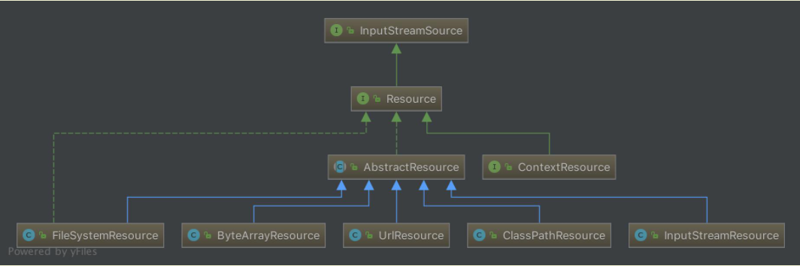
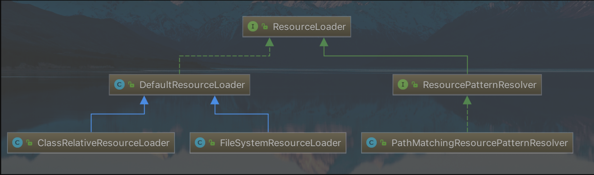

### Spring - IOC 统一资源加载策略


#### 1.统一的资源定义 Resource 接口

1. ##### 类图结构




针对不同的资源类型，提供了不同的具体实现：

- InputStreamSource : 资源定义的顶层接口，定义了获取输入流的接口方法
  - Resource : Spring所有资源的统一抽象和访问接口
    - AbstractResource: 抽象类，对Resouce接口的默认实现，子类可以根据实际情况，进行不同的实现，如果需要自定义Resouce，则可以直接继承该类，并实现自己的方法。
      - FileSystemResource : 对 java.io.file 的封装，可以查看源码的构造方法。
      - ByteArrayResource ：对字节数组进行了封装，字节数组可以构造成 ByteArrayInputStream 字节数组输入流
      - UrlResource ：对网络资源的定义，内部对 java.net.url 进行了封装
      - ClassPathResource ：对class path下的资源的实现，使用给定的 classLoader 或者  clazz 对象来定义资源
      - InputStreamResource ：对 InputStream 对象进行的封装


##### 1.1.AbstractResource 抽象类注释

```Java
/**
 * Convenience base class for {@link Resource} implementations,
 * pre-implementing typical behavior.
 *
 * <p>The "exists" method will check whether a File or InputStream can
 * be opened; "isOpen" will always return false; "getURL" and "getFile"
 * throw an exception; and "toString" will return the description.
 *
 * @note 针对Resource接口的默认实现，其他的子类都将根据自身的需要重写这些默认实现
 *
 * @author Juergen Hoeller
 * @author Sam Brannen
 * @since 28.12.2003
 */
public abstract class AbstractResource implements Resource {

	/**
	 * 该方法用来检验文件是否可以被打开，检验文件是否存在
	 */
	@Override
	public boolean exists() {
		//校验该资源是否为文件类型
		if (isFile()) {
			try {
				//调用Java io 的api判断文件是否存在
				return getFile().exists();
			}
			catch (IOException ex) {
				Log logger = LogFactory.getLog(getClass());
				if (logger.isDebugEnabled()) {
					logger.debug("Could not retrieve File for existence check of " + getDescription(), ex);
				}
			}
		}
		// 以下操作获取到流后，关闭输入流，具体实现由子类去操作
		try {
			getInputStream().close();
			return true;
		}
		catch (Throwable ex) {
			Log logger = LogFactory.getLog(getClass());
			if (logger.isDebugEnabled()) {
				logger.debug("Could not retrieve InputStream for existence check of " + getDescription(), ex);
			}
			return false;
		}
	}

	/**
	 * 默认返回true，表示可读
	 */
	@Override
	public boolean isReadable() {
		return exists();
	}

	/**
	 * 资源是否已经打开，默认返回false，表示未打开
	 */
	@Override
	public boolean isOpen() {
		return false;
	}

	/**
	 * 默认返回false，表示不是文件
	 */
	@Override
	public boolean isFile() {
		return false;
	}

	/**
	 * 默认抛出异常，表示该文件无法被解析成URL，需要子类实现
	 */
	@Override
	public URL getURL() throws IOException {
		throw new FileNotFoundException(getDescription() + " cannot be resolved to URL");
	}

	/**
	 * 基于getURL获得的 URL来构建 URI
	 */
	@Override
	public URI getURI() throws IOException {
		URL url = getURL();
		try {
			return ResourceUtils.toURI(url);
		}
		catch (URISyntaxException ex) {
			throw new NestedIOException("Invalid URI [" + url + "]", ex);
		}
	}

	/**
	 * 默认返回异常，表示无法解析文件，交由子类去实现
	 */
	@Override
	public File getFile() throws IOException {
		throw new FileNotFoundException(getDescription() + " cannot be resolved to absolute file path");
	}

	/**
	 * 根据  getInputStream() 返回，构建 ReadableByteChannel
	 *
	 */
	@Override
	public ReadableByteChannel readableChannel() throws IOException {
		return Channels.newChannel(getInputStream());
	}

	/**
	 * 获取资源的长度
	 * 资源的长度 = 资源转为输入流后，字节数组的长度
	 */
	@Override
	public long contentLength() throws IOException {
		InputStream is = getInputStream();
		try {
			long size = 0;
			byte[] buf = new byte[256];
			int read;
			while ((read = is.read(buf)) != -1) {
				size += read;
			}
			return size;
		}
		finally {
			try {
				is.close();
			}
			catch (IOException ex) {
				Log logger = LogFactory.getLog(getClass());
				if (logger.isDebugEnabled()) {
					logger.debug("Could not close content-length InputStream for " + getDescription(), ex);
				}
			}
		}
	}

	/**
	 * 资源的上次修改时间，返回的是毫秒值
	 */
	@Override
	public long lastModified() throws IOException {
		File fileToCheck = getFileForLastModifiedCheck();
		long lastModified = fileToCheck.lastModified();
		if (lastModified == 0L && !fileToCheck.exists()) {
			throw new FileNotFoundException(getDescription() +
					" cannot be resolved in the file system for checking its last-modified timestamp");
		}
		return lastModified;
	}

	/**
	 * Determine the File to use for timestamp checking.
	 * <p>The default implementation delegates to {@link #getFile()}.
	 * @return the File to use for timestamp checking (never {@code null})
	 * @throws FileNotFoundException if the resource cannot be resolved as
	 * an absolute file path, i.e. is not available in a file system
	 * @throws IOException in case of general resolution/reading failures
	 */
	protected File getFileForLastModifiedCheck() throws IOException {
		return getFile();
	}

	/**
	 * 根据相对路径创建资源，默认抛出异常，交由子类实现该方法
	 */
	@Override
	public Resource createRelative(String relativePath) throws IOException {
		throw new FileNotFoundException("Cannot create a relative resource for " + getDescription());
	}

	/**
	 * 获取文件名称，默认返回null值
	 */
	@Override
	@Nullable
	public String getFilename() {
		return null;
	}


	/**
	 * This implementation compares description strings.
	 * @see #getDescription()
	 */
	@Override
	public boolean equals(@Nullable Object other) {
		return (this == other || (other instanceof Resource &&
				((Resource) other).getDescription().equals(getDescription())));
	}

	/**
	 * This implementation returns the description's hash code.
	 * @see #getDescription()
	 */
	@Override
	public int hashCode() {
		return getDescription().hashCode();
	}

	/**
	 * This implementation returns the description of this resource.
	 * @see #getDescription()
	 */
	@Override
	public String toString() {
		return getDescription();
	}

}

```


#### 2.统一资源加载 ResourceLoader 接口

1. **类结构图**



- ResouceLoader ：统一的资源加载器
  - DefaultResouceLoader ：默认的资源加载器的实现
    - ClassRelativeResourceLoader：
    - FileSystemResouceLoader：
  - ResourcePatternResolver：
  - PathMatchingResoucePatternResolver：


##### 2.1  DefaultResouceLoader  (ResourceLoader接口的默认实现)

1. ResourceLoader的默认实现
2. 核心方法是 getResource() 方法获取资源

```java
/**
 * Default implementation of the {@link ResourceLoader} interface.
 * Used by {@link ResourceEditor}, and serves as base class for
 * {@link org.springframework.context.support.AbstractApplicationContext}.
 * Can also be used standalone.
 *
 * <p>Will return a {@link UrlResource} if the location value is a URL,
 * and a {@link ClassPathResource} if it is a non-URL path or a
 * "classpath:" pseudo-URL.
 *
 * @author Juergen Hoeller
 * @since 10.03.2004
 * @see FileSystemResourceLoader
 * @see org.springframework.context.support.ClassPathXmlApplicationContext
 *
 * ResourceLoader接口的默认实现
 */
public class DefaultResourceLoader implements ResourceLoader {

	@Nullable
	private ClassLoader classLoader;

	private final Set<ProtocolResolver> protocolResolvers = new LinkedHashSet<>(4);

	private final Map<Class<?>, Map<Resource, ?>> resourceCaches = new ConcurrentHashMap<>(4);


	/**
	 * Create a new DefaultResourceLoader.
	 * <p>ClassLoader access will happen using the thread context class loader
	 * at the time of actual resource access (since 5.3). For more control, pass
	 * a specific ClassLoader to {@link #DefaultResourceLoader(ClassLoader)}.
	 * @see java.lang.Thread#getContextClassLoader()
	 */
	public DefaultResourceLoader() {
	}

	/**
	 * Create a new DefaultResourceLoader.
	 * @param classLoader the ClassLoader to load class path resources with, or {@code null}
	 * for using the thread context class loader at the time of actual resource access
	 */
	public DefaultResourceLoader(@Nullable ClassLoader classLoader) {
		this.classLoader = classLoader;
	}


	/**
	 * Specify the ClassLoader to load class path resources with, or {@code null}
	 * for using the thread context class loader at the time of actual resource access.
	 * <p>The default is that ClassLoader access will happen using the thread context
	 * class loader at the time of actual resource access (since 5.3).
	 */
	public void setClassLoader(@Nullable ClassLoader classLoader) {
		this.classLoader = classLoader;
	}

	/**
	 * Return the ClassLoader to load class path resources with.
	 * <p>Will get passed to ClassPathResource's constructor for all
	 * ClassPathResource objects created by this resource loader.
	 * @see ClassPathResource
	 */
	@Override
	@Nullable
	public ClassLoader getClassLoader() {
		return (this.classLoader != null ? this.classLoader : ClassUtils.getDefaultClassLoader());
	}

	/**
	 * Register the given resolver with this resource loader, allowing for
	 * additional protocols to be handled.
	 * <p>Any such resolver will be invoked ahead of this loader's standard
	 * resolution rules. It may therefore also override any default rules.
	 * @since 4.3
	 * @see #getProtocolResolvers()
	 */
	public void addProtocolResolver(ProtocolResolver resolver) {
		Assert.notNull(resolver, "ProtocolResolver must not be null");
		this.protocolResolvers.add(resolver);
	}

	/**
	 * Return the collection of currently registered protocol resolvers,
	 * allowing for introspection as well as modification.
	 * @since 4.3
	 */
	public Collection<ProtocolResolver> getProtocolResolvers() {
		return this.protocolResolvers;
	}

	/**
	 * Obtain a cache for the given value type, keyed by {@link Resource}.
	 * @param valueType the value type, e.g. an ASM {@code MetadataReader}
	 * @return the cache {@link Map}, shared at the {@code ResourceLoader} level
	 * @since 5.0
	 */
	@SuppressWarnings("unchecked")
	public <T> Map<Resource, T> getResourceCache(Class<T> valueType) {
		return (Map<Resource, T>) this.resourceCaches.computeIfAbsent(valueType, key -> new ConcurrentHashMap<>());
	}

	/**
	 * Clear all resource caches in this resource loader.
	 * @since 5.0
	 * @see #getResourceCache
	 */
	public void clearResourceCaches() {
		this.resourceCaches.clear();
	}


	/**
	 * 核心方法
	 * @param location
	 * @return
	 */
	@Override
	public Resource getResource(String location) {
		Assert.notNull(location, "Location must not be null");

		//根据用户自定义的协议资源解析器解析资源，得到resource对象
		for (ProtocolResolver protocolResolver : getProtocolResolvers()) {
			Resource resource = protocolResolver.resolve(location, this);
			if (resource != null) {
				return resource;
			}
		}

		if (location.startsWith("/")) {
			//以 "/" 开头，返回 ClassPathContextResource 对象
			return getResourceByPath(location);
		}
		else if (location.startsWith(CLASSPATH_URL_PREFIX)) {
			// 以  "classpath:"  开头，则返回 ClassPathResource 对象
			return new ClassPathResource(location.substring(CLASSPATH_URL_PREFIX.length()), getClassLoader());
		}
		else {
			try {
				//以上条件都不满足，则创建URL对象，如果构造失败，则调用catch块中的代码
				// Try to parse the location as a URL...
				URL url = new URL(location);
				//根据是否为File类型的对象，来返回不同的Resource对象
				return (ResourceUtils.isFileURL(url) ? new FileUrlResource(url) : new UrlResource(url));
			}
			catch (MalformedURLException ex) {
				//创建URL类型的resource异常，则调用以下方法，返回 ClassPathContextResource 对象
				// No URL -> resolve as resource path.
				return getResourceByPath(location);
			}
		}
	}

	/**
	 * Return a Resource handle for the resource at the given path.
	 * <p>The default implementation supports class path locations. This should
	 * be appropriate for standalone implementations but can be overridden,
	 * e.g. for implementations targeted at a Servlet container.
	 * @param path the path to the resource
	 * @return the corresponding Resource handle
	 * @see ClassPathResource
	 * @see org.springframework.context.support.FileSystemXmlApplicationContext#getResourceByPath
	 * @see org.springframework.web.context.support.XmlWebApplicationContext#getResourceByPath
	 */
	protected Resource getResourceByPath(String path) {
		//直接调用构造方法返回
		return new ClassPathContextResource(path, getClassLoader());
	}


	/**
	 * ClassPathResource that explicitly expresses a context-relative path
	 * through implementing the ContextResource interface.
	 */
	protected static class ClassPathContextResource extends ClassPathResource implements ContextResource {

		public ClassPathContextResource(String path, @Nullable ClassLoader classLoader) {
			super(path, classLoader);
		}

		@Override
		public String getPathWithinContext() {
			return getPath();
		}

		@Override
		public Resource createRelative(String relativePath) {
			String pathToUse = StringUtils.applyRelativePath(getPath(), relativePath);
			return new ClassPathContextResource(pathToUse, getClassLoader());
		}
	}

}

```


##### 2.2  FileSystemResourceLoader

1. DefaultResorceLoader的子类
2. 从文件系统加载资源，返回 FileSystemResource对象

```Java
/**
 * {@link ResourceLoader} implementation that resolves plain paths as
 * file system resources rather than as class path resources
 * (the latter is {@link DefaultResourceLoader}'s default strategy).
 *
 * <p><b>NOTE:</b> Plain paths will always be interpreted as relative
 * to the current VM working directory, even if they start with a slash.
 * (This is consistent with the semantics in a Servlet container.)
 * <b>Use an explicit "file:" prefix to enforce an absolute file path.</b>
 *
 * <p>{@link org.springframework.context.support.FileSystemXmlApplicationContext}
 * is a full-fledged ApplicationContext implementation that provides
 * the same resource path resolution strategy.
 *
 * @author Juergen Hoeller
 * @since 1.1.3
 * @see DefaultResourceLoader
 * @see org.springframework.context.support.FileSystemXmlApplicationContext
 * @note 从文件系统中加载对应的Resource对象
 */
public class FileSystemResourceLoader extends DefaultResourceLoader {

	/**
	 * Resolve resource paths as file system paths.
	 * <p>Note: Even if a given path starts with a slash, it will get
	 * interpreted as relative to the current VM working directory.
	 * @param path the path to the resource
	 * @return the corresponding Resource handle
	 * @see FileSystemResource
	 * @see org.springframework.web.context.support.ServletContextResourceLoader#getResourceByPath
	 *
	 * @note 和新方法实现
	 */
	@Override
	protected Resource getResourceByPath(String path) {
		// 以 "/" 开头，进行截取
		if (path.startsWith("/")) {
			path = path.substring(1);
		}
		//调用内部类的构造方法
		return new FileSystemContextResource(path);
	}


	/**
	 * FileSystemResource that explicitly expresses a context-relative path
	 * through implementing the ContextResource interface.
	 *
	 * FileSystemContextResource 继承自FileSystemResource，构造方法也是调用FileSystemResource的构造方法
	 * 实现 ContextResource
	 */
	private static class FileSystemContextResource extends FileSystemResource implements ContextResource {

		public FileSystemContextResource(String path) {
			super(path);
		}

		@Override
		public String getPathWithinContext() {
			return getPath();
		}
	}

}

```


##### 2.3 ClassRelativeResourceLoader 

1. DefaultResourceLoader的子类
2. 从指定的路径下，根据给定的Class对象返回 ClassPathResource 对象

```Java
/**
 * {@link ResourceLoader} implementation that interprets plain resource paths
 * as relative to a given {@code java.lang.Class}.
 *
 * @author Juergen Hoeller
 * @since 3.0
 * @see Class#getResource(String)
 * @see ClassPathResource#ClassPathResource(String, Class)
 * @note 根据给定的class对象以及class所在的路径返回指定的Resource对象
 */
public class ClassRelativeResourceLoader extends DefaultResourceLoader {

	private final Class<?> clazz;


	/**
	 * Create a new ClassRelativeResourceLoader for the given class.
	 * @param clazz the class to load resources through
	 */
	public ClassRelativeResourceLoader(Class<?> clazz) {
		Assert.notNull(clazz, "Class must not be null");
		this.clazz = clazz;
		setClassLoader(clazz.getClassLoader());
	}

	@Override
	protected Resource getResourceByPath(String path) {
		//直接调用内部类构造器
		return new ClassRelativeContextResource(path, this.clazz);
	}


	/**
	 * ClassPathResource that explicitly expresses a context-relative path
	 * through implementing the ContextResource interface.
	 * 继承 ClassPathResource ，实现了 ContextResource，构造方法也是直接调用 ClassPathResource 的构造方法
	 * 类似FileSystemResourceLoader中的 FileSystemContextResource内部类
	 */
	private static class ClassRelativeContextResource extends ClassPathResource implements ContextResource {

		private final Class<?> clazz;

		public ClassRelativeContextResource(String path, Class<?> clazz) {
			super(path, clazz);
			this.clazz = clazz;
		}

		@Override
		public String getPathWithinContext() {
			return getPath();
		}

		@Override
		public Resource createRelative(String relativePath) {
			String pathToUse = StringUtils.applyRelativePath(getPath(), relativePath);
			return new ClassRelativeContextResource(pathToUse, this.clazz);
		}
	}

}

```


##### 2.4 ResourcePatternResolver 

1. 继承 ResourceLoader
2. DefaultResourceLoader 的 Resource getResourceByPath(String path) 方法只能返回一个 Resource 对象，加载多个资源的情况下，只能循环调用，比较局限
3. Resource[] getResources(String locationPattern)方法，根据 资源的路径匹配规则 返回多个Resource 对象

```Java
/**
 * Strategy interface for resolving a location pattern (for example,
 * an Ant-style path pattern) into {@link Resource} objects.
 *
 * <p>This is an extension to the {@link org.springframework.core.io.ResourceLoader}
 * interface. A passed-in {@code ResourceLoader} (for example, an
 * {@link org.springframework.context.ApplicationContext} passed in via
 * {@link org.springframework.context.ResourceLoaderAware} when running in a context)
 * can be checked whether it implements this extended interface too.
 *
 * <p>{@link PathMatchingResourcePatternResolver} is a standalone implementation
 * that is usable outside an {@code ApplicationContext}, also used by
 * {@link ResourceArrayPropertyEditor} for populating {@code Resource} array bean
 * properties.
 *
 * <p>Can be used with any sort of location pattern (e.g. "/WEB-INF/*-context.xml"):
 * Input patterns have to match the strategy implementation. This interface just
 * specifies the conversion method rather than a specific pattern format.
 *
 * <p>This interface also suggests a new resource prefix "classpath*:" for all
 * matching resources from the class path. Note that the resource location is
 * expected to be a path without placeholders in this case (e.g. "/beans.xml");
 * JAR files or different directories in the class path can contain multiple files
 * of the same name.
 *
 * @author Juergen Hoeller
 * @since 1.0.2
 * @see org.springframework.core.io.Resource
 * @see org.springframework.core.io.ResourceLoader
 * @see org.springframework.context.ApplicationContext
 * @see org.springframework.context.ResourceLoaderAware
 * @note 支持根据路径的匹配规则加载多个资源
 */
public interface ResourcePatternResolver extends ResourceLoader {

	/**
	 * Pseudo URL prefix for all matching resources from the class path: "classpath*:"
	 * <p>This differs from ResourceLoader's classpath URL prefix in that it
	 * retrieves all matching resources for a given name (e.g. "/beans.xml"),
	 * for example in the root of all deployed JAR files.
	 * @see org.springframework.core.io.ResourceLoader#CLASSPATH_URL_PREFIX
	 */
	String CLASSPATH_ALL_URL_PREFIX = "classpath*:";

	/**
	 * Resolve the given location pattern into {@code Resource} objects.
	 * <p>Overlapping resource entries that point to the same physical
	 * resource should be avoided, as far as possible. The result should
	 * have set semantics.
	 * @param locationPattern the location pattern to resolve
	 * @return the corresponding {@code Resource} objects
	 * @throws IOException in case of I/O errors
	 * 
	 * 支持根据路径的匹配规则加载多个资源
	 */
	Resource[] getResources(String locationPattern) throws IOException;

}

```


2.4.1 