# 监控平台安装文档

## 第一阶段 ：入门

### 1.监控平台的使用背景

**日志监控：**监控项目的日志输出。目前我们项目的日志一般都是输出到某个日志文件中，并且制定了一些日志策略，需要聚合项目日志统一查询，分析。

**服务监控：**监控服务的状态，内存使用情况。如Java项目，可以对JVM的状态进行监控。

**资源监控：**监控服务器的资源使用情况，如CPU使用率，内存使用率，磁盘使用率等。


### 2.安装步骤

#### 2.1 安装可视化工具Grafana

Grafana可以将监控数据转为可视化的图表，可以将Prometheus ，Loki，elasticsearch等作为数据源，我们这次使用了loki，Prometheus作为数据源分别来监控日志和服务器资源。[查看官网](https://grafana.com/)

**部署命令**

```
docker run -d --name grafana  -p 3000:3000 grafana/grafana grafana
```


**安装验证**

1. 浏览器中访问 IP:3000 ，访问grafana。

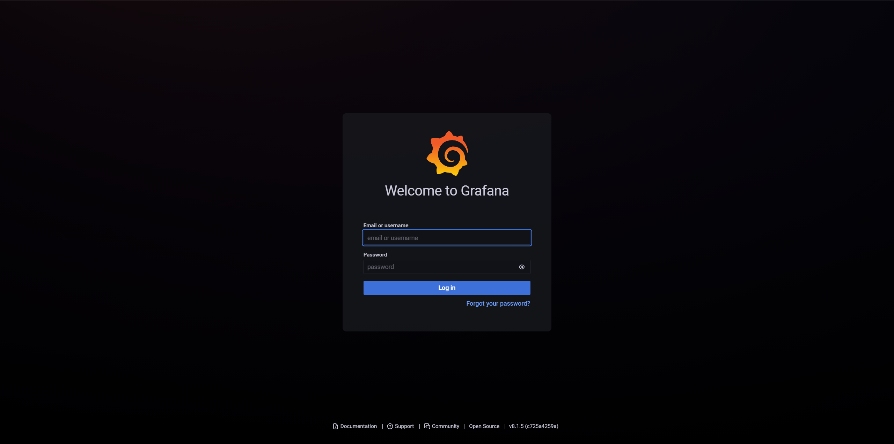


2. 登录。默认用户admin，密码admin


#### 2.2 安装Prometheus

开源实时监控告警解决方案。[查看官网](https://prometheus.io/)

**安装配置**

1. 创建配置文件目录

```
mkdir /home/monitor/prometheus
```

2. 创建配置文件 prometheus.yml

```yml
# my global config
global:
  scrape_interval:     15s # Set the scrape interval to every 15 seconds. Default is every 1 minute.
  evaluation_interval: 15s # Evaluate rules every 15 seconds. The default is every 1 minute.
  # scrape_timeout is set to the global default (10s).

# Alertmanager configuration
alerting:
  alertmanagers:
    - static_configs:
        - targets:
          # - alertmanager:9093

# Load rules once and periodically evaluate them according to the global 'evaluation_interval'.
rule_files:
# - "first_rules.yml"
# - "second_rules.yml"

# A scrape configuration containing exactly one endpoint to scrape:
# Here it's Prometheus itself.
scrape_configs:
  # The job name is added as a label `job=<job_name>` to any timeseries scraped from this config.
  - job_name: 'prometheus'

    # metrics_path defaults to '/metrics'
    # scheme defaults to 'http'.

    static_configs:
      - targets: ['localhost:9090']


```


**部署命令**

```
docker run --name  prometheus   -p 9090:9090 -d     -v /home/monitor/prometheus/:/etc/prometheus     prom/prometheus
```


**验证安装**

1. 浏览器访问 IP:9090

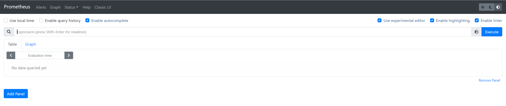


2. 查看监控目标

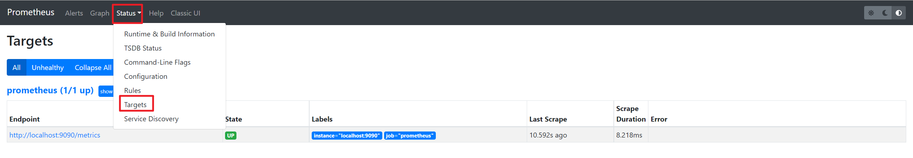


#### 2.3 Grafana中配置Prometheus为数据源

我们需要在Grafana添加Prometheus为数据源，Grafana会将监控数据图表化


**配置Prometheus数据源**

1. 进入数据源配置页面

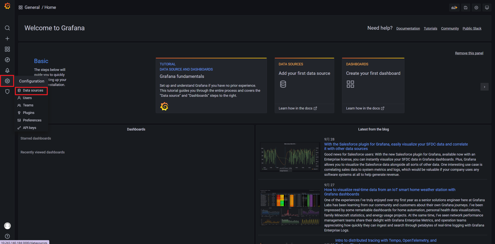


2. 点击 Add data source 添加数据源

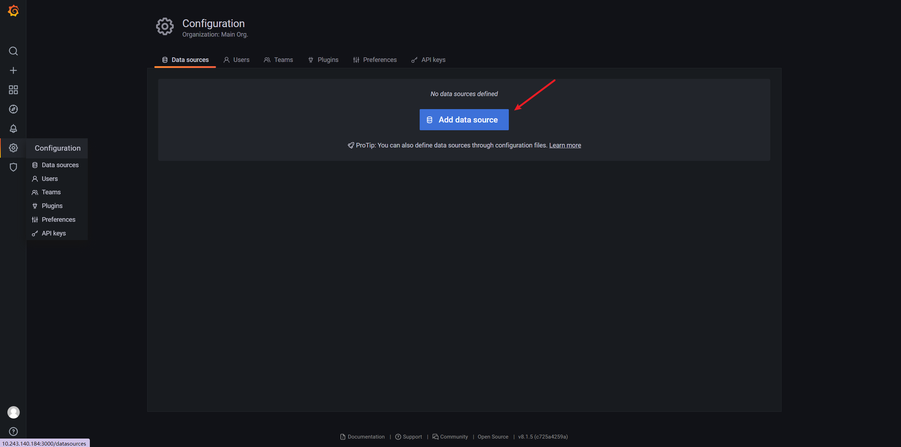


3. 选择 Prometheus 为数据源

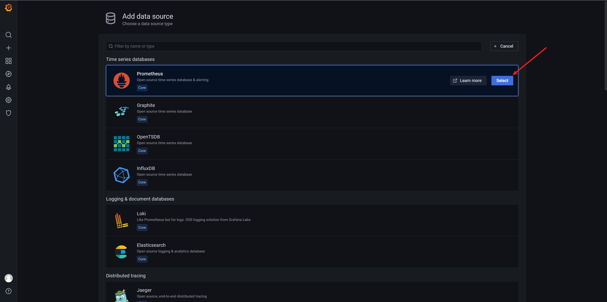


4. 输入Prometheus的 IP和端口信息 

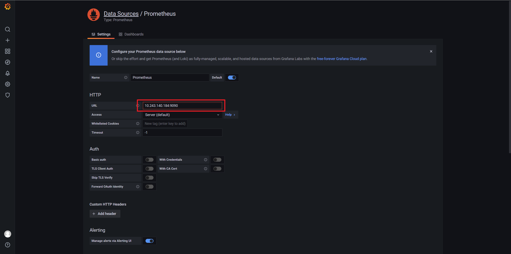


5. Save & test  保存配置

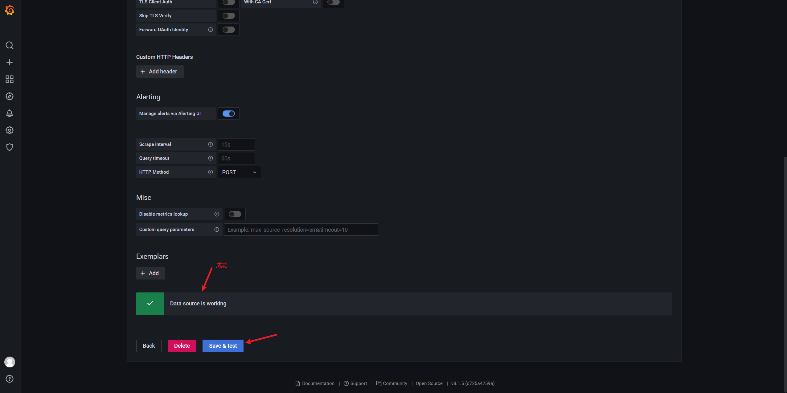


#### 2.4 安装 Node Exporter 

采集服务器主机的运行数据。如果需要监控哪一台机器，就在哪一台机器上面部署 Node Exporter。


**修改Prometheus配置文件，添加 Node Exporter 配置**

1. 添加配置

```
  - job_name: 'server'
    static_configs:
      - targets: ['10.243.140.184:9100']
```

修改后的  prometheus.yml  

```yml
# my global config
global:
  scrape_interval:     15s # Set the scrape interval to every 15 seconds. Default is every 1 minute.
  evaluation_interval: 15s # Evaluate rules every 15 seconds. The default is every 1 minute.
  # scrape_timeout is set to the global default (10s).

# Alertmanager configuration
alerting:
  alertmanagers:
    - static_configs:
        - targets:
          # - alertmanager:9093

# Load rules once and periodically evaluate them according to the global 'evaluation_interval'.
rule_files:
# - "first_rules.yml"
# - "second_rules.yml"

# A scrape configuration containing exactly one endpoint to scrape:
# Here it's Prometheus itself.
scrape_configs:
  # The job name is added as a label `job=<job_name>` to any timeseries scraped from this config.
  - job_name: 'prometheus'

    # metrics_path defaults to '/metrics'
    # scheme defaults to 'http'.

    static_configs:
      - targets: ['localhost:9090']

  - job_name: 'server'
    static_configs:
      - targets: ['10.243.140.184:9100']

```


**重启Prometheus**

```
docker restart prometheus
```


**部署命令**

```
docker run -d --name node_exporter   -p 9100:9100     -v "/:/host:ro,rslave"   quay.io/prometheus/node-exporter   --path.rootfs=/host
```


**导入  Node Exporter  控制面板，ID: 8919**  

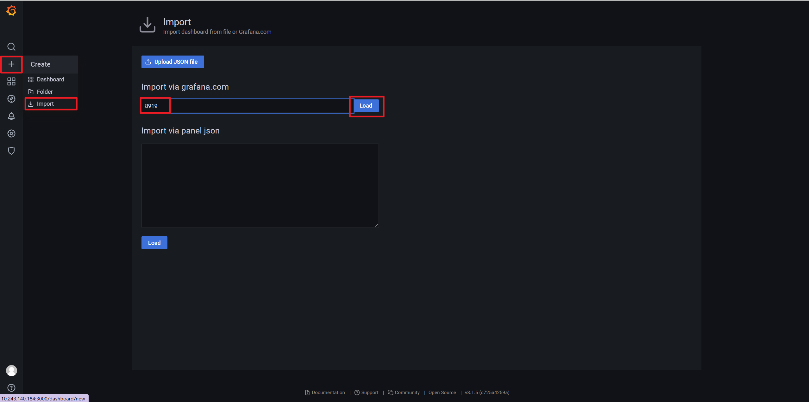


**配置选项**

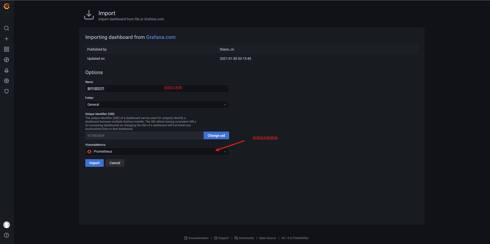


**验证安装与配置**

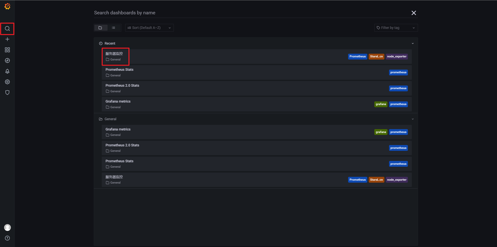

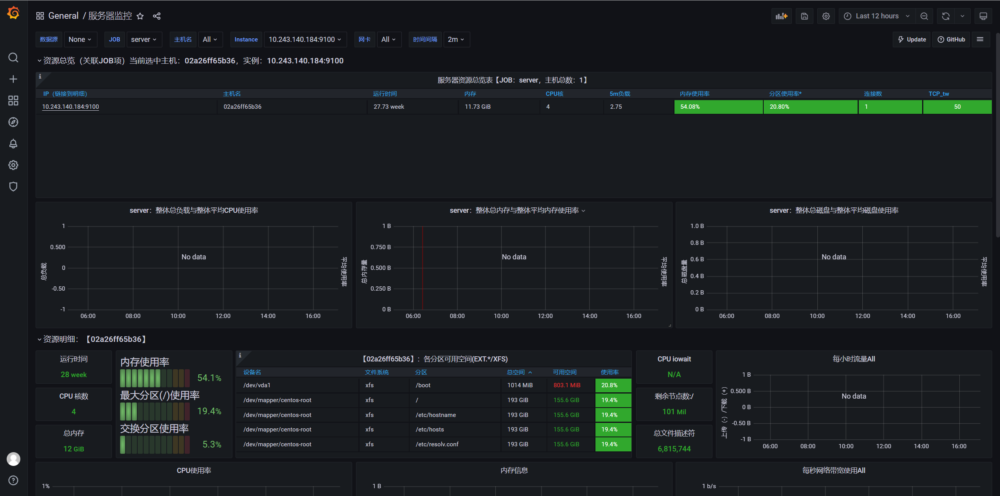


#### 2.5 安装 mysqld-exporter

采集数据库的运行数据。同上，需要监控哪天机器上的数据库，就需要在哪台机器上部署


**修改Prometheus配置文件，添加 mysqld-exporter 配置**

1. 添加配置

```
  - job_name: 'Mysql'
    static_configs:
      - targets: ['10.253.48.53:9104']
```

修改后的  prometheus.yml  

```yml
# my global config
global:
  scrape_interval:     15s # Set the scrape interval to every 15 seconds. Default is every 1 minute.
  evaluation_interval: 15s # Evaluate rules every 15 seconds. The default is every 1 minute.
  # scrape_timeout is set to the global default (10s).

# Alertmanager configuration
alerting:
  alertmanagers:
    - static_configs:
        - targets:
          # - alertmanager:9093

# Load rules once and periodically evaluate them according to the global 'evaluation_interval'.
rule_files:
# - "first_rules.yml"
# - "second_rules.yml"

# A scrape configuration containing exactly one endpoint to scrape:
# Here it's Prometheus itself.
scrape_configs:
  # The job name is added as a label `job=<job_name>` to any timeseries scraped from this config.
  - job_name: 'prometheus'

    # metrics_path defaults to '/metrics'
    # scheme defaults to 'http'.

    static_configs:
      - targets: ['localhost:9090']

  - job_name: 'server'
    static_configs:
      - targets: ['10.243.140.184:9100']
      
  - job_name: 'Mysql'
    static_configs:
      - targets: ['10.253.48.53:9104']

```


**重启Prometheus**

```
docker restart prometheus
```


**导入 MySQL  控制面板，ID: 7362**  

导入的方式参考 Node Exporter 。

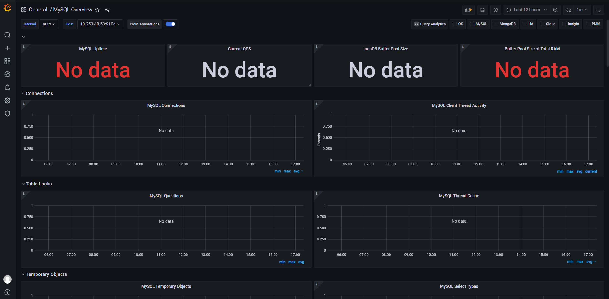


#### 2.6 部署 Grafana Loki 

Loki 是 Grafana Labs 团队最新的开源项目，是一个水平可扩展，高可用性，多租户的日志聚合系统。它的设计非常经济高效且易于操作，因为它不会为日志内容编制索引，而是为每个日志流编制一组标签，专门为 Prometheus 和 Kubernetes 用户做了相关优化。该项目受 Prometheus 启发，官方的介绍就是： `Like Prometheus,But For Logs.`，类似于 Prometheus 的日志系统。[官方部署文档](https://grafana.com/docs/loki/latest/installation/docker/)


**配置文件**

1. 创建loki配置文件

```shell
cd /home/monitor/loki
```

loki-config.yaml

```yml
auth_enabled: false

server:
  http_listen_port: 3100
  grpc_listen_port: 9096

ingester:
  wal:
    enabled: true
    dir: /tmp/wal
  lifecycler:
    address: 127.0.0.1
    ring:
      kvstore:
        store: inmemory
      replication_factor: 1
    final_sleep: 0s
  chunk_idle_period: 1h       # Any chunk not receiving new logs in this time will be flushed
  max_chunk_age: 1h           # All chunks will be flushed when they hit this age, default is 1h
  chunk_target_size: 1048576  # Loki will attempt to build chunks up to 1.5MB, flushing first if chunk_idle_period or max_chunk_age is reached first
  chunk_retain_period: 30s    # Must be greater than index read cache TTL if using an index cache (Default index read cache TTL is 5m)
  max_transfer_retries: 0     # Chunk transfers disabled

schema_config:
  configs:
    - from: 2020-10-24
      store: boltdb-shipper
      object_store: filesystem
      schema: v11
      index:
        prefix: index_
        period: 24h

storage_config:
  boltdb_shipper:
    active_index_directory: /tmp/loki/boltdb-shipper-active
    cache_location: /tmp/loki/boltdb-shipper-cache
    cache_ttl: 24h         # Can be increased for faster performance over longer query periods, uses more disk space
    shared_store: filesystem
  filesystem:
    directory: /tmp/loki/chunks

compactor:
  working_directory: /tmp/loki/boltdb-shipper-compactor
  shared_store: filesystem

limits_config:
  reject_old_samples: true
  reject_old_samples_max_age: 168h

chunk_store_config:
  max_look_back_period: 0s

table_manager:
  retention_deletes_enabled: false
  retention_period: 0s

ruler:
  storage:
    type: local
    local:
      directory: /tmp/loki/rules
  rule_path: /tmp/loki/rules-temp
  alertmanager_url: http://localhost:9093
  ring:
    kvstore:
      store: inmemory
  enable_api: true

```


**部署命令**

```
docker run -d -v $(pwd):/mnt/config --name loki -p 3100:3100 grafana/loki:2.3.0 -config.file=/mnt/config/loki-config.yaml
```


**Grafana中配置Loki**

1. 数据源选择Loki

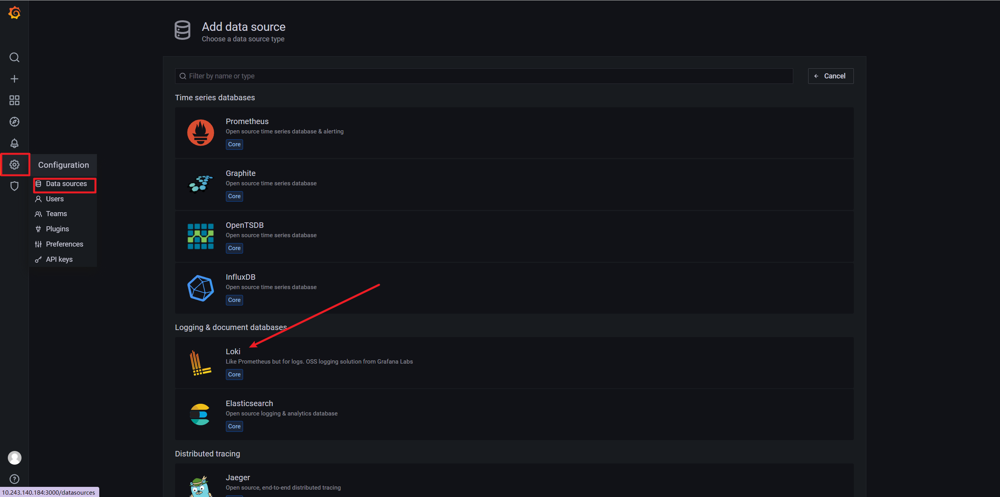


2. 配置IP和端口 ，Save & test

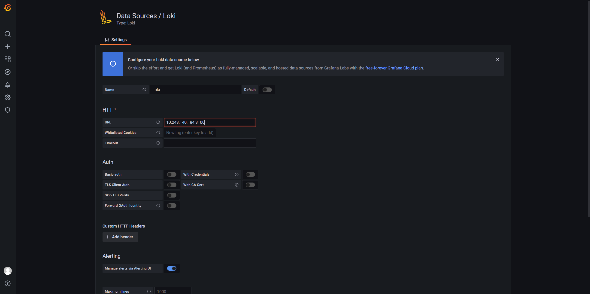


##### 2.6.1 部署 promtail 监听日志

Promtail is an agent which ships the contents of local logs to a private Loki instance or [Grafana Cloud](https://grafana.com/oss/loki). It is usually deployed to every machine that has applications needed to be monitored.  [官方文档](https://grafana.com/docs/loki/latest/clients/promtail/)

如果需要监听哪一台服务器，就需要在哪一台服务器上安装


**配置文件**

创建 promtail-config.yaml

```
cd /home/monitor/loki
```

配置内容：

```yaml
server:
  http_listen_port: 9080
  grpc_listen_port: 0

positions:
  filename: /tmp/positions.yaml

clients:
  - url: http://loki:3100/loki/api/v1/push  # Loki的地址，只需要将ip替换成你部署的

scrape_configs:
- job_name: system
  static_configs:
  - targets:
      - localhost
    labels:
      job: varlogs
      __path__: /home/ksquant/qtserver/test/logs  # 需要监听的日志目录

```


**部署命令**

```
docker run -d --privileged=true -v $(pwd):/mnt/config -v /home/ksquant/qtserver/test/logs:/home/ksquant/qtserver/test/logs grafana/promtail:2.3.0 -config.file=/mnt/config/promtail-config.yaml
```

- -v /home/ksquant/qtserver/test/logs:/home/ksquant/qtserver/test/logs ：日志的挂载目录，你需要监听的日志目录
