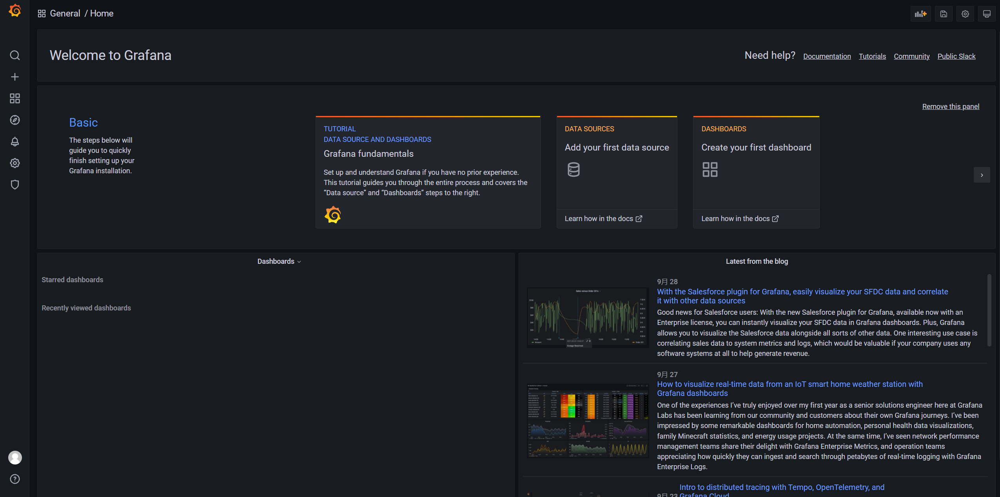

## 技术监控

### 技术监控简述

**日志监控：**监控项目的日志输出。目前我们项目的日志一般都是输出到某个日志文件中，并且制定了一些日志策略，需要聚合项目日志统一查询，分析。

**服务监控：**监控服务的状态，内存使用情况。如Java项目，可以对JVM的状态进行监控。

**资源监控：**监控服务器的资源使用情况，如CPU使用率，内存使用率，磁盘使用率等。

**链路追踪：**系统有多个微服务的时候，服务间存在复杂的调用关系，如果在一次服务调用中发生报错，没有链路追踪技术的帮助，难以排查系统bug，所以我们可以借助链路追踪技术，来帮助我们梳理和排查服务间调用中出现的问题。


### 技术监控实践

#### Grafana-可视化工具

##### 简介

Grafana可以将监控数据转为可视化的图表，可以将Prometheus ，Loki，elasticsearch等作为数据源，我们这次使用了loki，Prometheus作为数据源分别来监控日志和服务器资源。[查看官网](https://grafana.com/)

##### 部署

```
docker run -d --name grafana  -p 3000:3000 grafana/grafana grafana
```

##### 验证

1. 浏览器中访问 IP:3000 ，访问grafana。


2. 登录。默认用户admin，密码admin




#### Prometheus-系统监控与警告

##### 简介

开源实时监控告警解决方案。[查看官网](https://prometheus.io/)

##### 部署

1. 创建配置文件目录

```
mkdir -p /home/monitor/prometheus
```

2. 创建配置文件 prometheus.yml

```yml
# my global config
global:
  scrape_interval:     15s # Set the scrape interval to every 15 seconds. Default is every 1 minute.
  evaluation_interval: 15s # Evaluate rules every 15 seconds. The default is every 1 minute.
  # scrape_timeout is set to the global default (10s).

# Alertmanager configuration
alerting:
  alertmanagers:
    - static_configs:
        - targets:
          # - alertmanager:9093

# Load rules once and periodically evaluate them according to the global 'evaluation_interval'.
rule_files:
# - "first_rules.yml"
# - "second_rules.yml"

# A scrape configuration containing exactly one endpoint to scrape:
# Here it's Prometheus itself.
scrape_configs:
  # The job name is added as a label `job=<job_name>` to any timeseries scraped from this config.
  - job_name: 'prometheus'
    static_configs:
      - targets: ['localhost:9090']
```


3. 执行docker命令

```
docker run  -d  --name prometheus   -p 9090:9090   -v /home/monitor/prometheus/:/etc/prometheus  prom/prometheus  --config.file=/etc/prometheus/prometheus.yml --web.enable-lifecycle
```

- web.enable-lifecycle：开启热更新

开启热更新后，在修改完Prometheus配置文件后可以在Linux执行http请求重新加载配置文件，需要修改IP为Prometheus的实际地址

```
curl -X POST http://192.168.X.X:9090/-/reload
```


##### 验证

1. 浏览器访问 IP:9090


2. 查看监控目标

可以看到Prometheus名称的target


#### Node Exporter-目标主机监控

##### 简介

采集服务器主机的运行数据。如果需要监控哪一台机器，就在哪一台机器上面部署 Node Exporter。


##### 部署

```
docker run -d --name node_exporter   -p 9100:9100     -v "/:/host:ro,rslave"   quay.io/prometheus/node-exporter   --path.rootfs=/host
```


##### 验证

1. 添加配置，修改Prometheus配置文件，添加 Node Exporter 配置

```yml
  - job_name: 'server'
    static_configs:
      - targets: ['10.243.140.184:9100'] # 数组的形式，这里可以新增多个
```

2. 修改后的  prometheus.yml  

```yml
# my global config
global:
  scrape_interval:     15s # Set the scrape interval to every 15 seconds. Default is every 1 minute.
  evaluation_interval: 15s # Evaluate rules every 15 seconds. The default is every 1 minute.
  # scrape_timeout is set to the global default (10s).

# Alertmanager configuration
alerting:
  alertmanagers:
    - static_configs:
        - targets:
          # - alertmanager:9093

# Load rules once and periodically evaluate them according to the global 'evaluation_interval'.
rule_files:
# - "first_rules.yml"
# - "second_rules.yml"

# A scrape configuration containing exactly one endpoint to scrape:
# Here it's Prometheus itself.
scrape_configs:
  # The job name is added as a label `job=<job_name>` to any timeseries scraped from this config.
  - job_name: 'prometheus'

    # metrics_path defaults to '/metrics'
    # scheme defaults to 'http'.

    static_configs:
      - targets: ['localhost:9090']

  - job_name: 'server'
    static_configs:
      - targets: ['10.243.140.184:9100']

```


3. 执行上述文档中提到的热更新命令


4. 打开grafana，导入 node exporter的监控面板 ID: 8919


5. 配置数据源为Prometheus


6. 验证监控页面


#### Mysqld exporter - MySQL数据库监控

##### 简介

采集数据库的运行数据。同上，需要监控哪台机器上的数据库，就需要在哪台机器上部署

##### 部署

注意修改数据库的连接信息

```
docker run -d \
  --name mysql_exporter \
  --restart always \
  -p 9104:9104 \
  -e DATA_SOURCE_NAME="user:password@(my-mysql-ip:3306)/" \
  prom/mysqld-exporter
```


##### 验证

1. 添加配置，修改Prometheus配置文件，添加mysqld-exporter 配置

```yml
  - job_name: 'Mysql'
    static_configs:
      - targets: ['10.253.48.53:9104']
```

2. 修改后的  prometheus.yml  

```yml
# my global config
global:
  scrape_interval:     15s # Set the scrape interval to every 15 seconds. Default is every 1 minute.
  evaluation_interval: 15s # Evaluate rules every 15 seconds. The default is every 1 minute.
  # scrape_timeout is set to the global default (10s).

# Alertmanager configuration
alerting:
  alertmanagers:
    - static_configs:
        - targets:
          # - alertmanager:9093

# Load rules once and periodically evaluate them according to the global 'evaluation_interval'.
rule_files:
# - "first_rules.yml"
# - "second_rules.yml"

# A scrape configuration containing exactly one endpoint to scrape:
# Here it's Prometheus itself.
scrape_configs:
  # The job name is added as a label `job=<job_name>` to any timeseries scraped from this config.
  - job_name: 'prometheus'

    # metrics_path defaults to '/metrics'
    # scheme defaults to 'http'.

    static_configs:
      - targets: ['localhost:9090']

  - job_name: 'server'
    static_configs:
      - targets: ['10.243.140.184:9100']
      
  - job_name: 'Mysql'
    static_configs:
      - targets: ['10.253.48.53:9104']

```


3. 执行上述文档中提到的热更新命令


4. 打开grafana，导入 mysqld exporter的监控面板 ID: 7362

5. 导入的方式参考 Node Exporter 。


#### Kafka exporter - kafka监控


##### 部署

```
docker run -ti --rm -d --name kafka-exporter -p 9308:9308 danielqsj/kafka-exporter --kafka.server=10.253.48.53:9092  # 需要修改为自己的kafka地址 
```


##### 验证

1. 添加配置，修改Prometheus配置文件，添加Kafka-exporter 配置

```
  - job_name: 'Kafka'
    static_configs:
      - targets: ['10.253.50.55:9308','10.253.48.53:9308']
```


2. gafana中添加模板，导入方式同上


#### Grafana Loki - 日志监控

##### 简介

Loki 是 Grafana Labs 团队最新的开源项目，是一个水平可扩展，高可用性，多租户的日志聚合系统。它的设计非常经济高效且易于操作，因为它不会为日志内容编制索引，而是为每个日志流编制一组标签，专门为 Prometheus 和 Kubernetes 用户做了相关优化。该项目受 Prometheus 启发，官方的介绍就是： `Like Prometheus,But For Logs.`，类似于 Prometheus 的日志系统。[官方部署文档](https://grafana.com/docs/loki/latest/installation/docker/)


##### 部署

1. 创建loki配置文件

```shell
cd /home/monitor/loki
```

loki-config.yaml

```yml
auth_enabled: false

server:
  http_listen_port: 3100
  grpc_listen_port: 9096

ingester:
  wal:
    enabled: true
    dir: /tmp/wal
  lifecycler:
    address: 127.0.0.1
    ring:
      kvstore:
        store: inmemory
      replication_factor: 1
    final_sleep: 0s
  chunk_idle_period: 1h       # Any chunk not receiving new logs in this time will be flushed
  max_chunk_age: 1h           # All chunks will be flushed when they hit this age, default is 1h
  chunk_target_size: 1048576  # Loki will attempt to build chunks up to 1.5MB, flushing first if chunk_idle_period or max_chunk_age is reached first
  chunk_retain_period: 30s    # Must be greater than index read cache TTL if using an index cache (Default index read cache TTL is 5m)
  max_transfer_retries: 0     # Chunk transfers disabled

schema_config:
  configs:
    - from: 2020-10-24
      store: boltdb-shipper
      object_store: filesystem
      schema: v11
      index:
        prefix: index_
        period: 24h

storage_config:
  boltdb_shipper:
    active_index_directory: /tmp/loki/boltdb-shipper-active
    cache_location: /tmp/loki/boltdb-shipper-cache
    cache_ttl: 24h         # Can be increased for faster performance over longer query periods, uses more disk space
    shared_store: filesystem
  filesystem:
    directory: /tmp/loki/chunks

compactor:
  working_directory: /tmp/loki/boltdb-shipper-compactor
  shared_store: filesystem

limits_config:
  reject_old_samples: true
  reject_old_samples_max_age: 168h

chunk_store_config:
  max_look_back_period: 0s

table_manager:
  retention_deletes_enabled: false
  retention_period: 0s

ruler:
  storage:
    type: local
    local:
      directory: /tmp/loki/rules
  rule_path: /tmp/loki/rules-temp
  alertmanager_url: http://localhost:9093
  ring:
    kvstore:
      store: inmemory
  enable_api: true

```


3. 执行命令

```
docker run -d -v $(pwd):/mnt/config --name loki -p 3100:3100 grafana/loki:2.3.0 -config.file=/mnt/config/loki-config.yaml
```


##### 验证

Grafana中配置Loki

1. 数据源选择Loki


2. 配置IP和端口 ，Save & test


#### promtail - 监听传输日志

##### 简介

Promtail is an agent which ships the contents of local logs to a private Loki instance or [Grafana Cloud](https://grafana.com/oss/loki). It is usually deployed to every machine that has applications needed to be monitored.  [官方文档](https://grafana.com/docs/loki/latest/clients/promtail/)

如果需要监听哪一台服务器，就需要在哪一台服务器上安装


##### 部署

1. 创建 promtail-config.yaml

```
cd /home/monitor/loki
```

配置内容：

```yaml
server:
  http_listen_port: 9080
  grpc_listen_port: 0

positions:
  filename: /tmp/positions.yaml

clients:
  - url: http://loki:3100/loki/api/v1/push  # Loki的地址，只需要将ip替换成你部署的

scrape_configs:
- job_name: system
  static_configs:
  - targets:
      - localhost
    labels:
      job: myjob # 你所定义的日志类型名称
      __path__: /logs  # 需要监听的日志目录

```

2. 执行命令

```
docker run -d --name promtail --privileged=true -v $(pwd):/mnt/config -v /yourlog-path/yourlog.log:/logs grafana/promtail:2.3.0 -config.file=/mnt/config/promtail-config.yaml
```

- -v /yourlog-path/yourlog.log:/logs ：日志的挂载目录，你需要监听的日志目录


##### 使用

在Grafana中使用


#### JVM监控 ---- 待完成

1. 容器启动
2. jar包启动

**部署命令**

java -javaagent:./jmx_prometheus_javaagent-0.15.0.jar=8089:jmx_exporter_config.yaml -jar -Dspring.jmx.enabled=true 

```
docker run -d --name jmx-exporter -p "5556:5556" -v "$PWD/config.yml:/opt/jmx_exporter/config.yml" sscaling/jmx-prometheus-exporter
```


### 链路追踪

#### Sleuth + zipkin

##### 简介

sleuth：标记出一次调用请求的全部日志；梳理日志间的前后关系。也就是打标

zipkin：链路追踪数据可视化工具


##### 使用

**集成sleuth**

1. 添加sleuth依赖到目标服务的pom文件中

```xml
        <!-- Sleuth依赖项 -->
        <dependency>
            <groupId>org.springframework.cloud</groupId>
            <artifactId>spring-cloud-starter-sleuth</artifactId>
        </dependency>
```

2. 基础配置：在配置文件中添加采样率和每秒采样记录条数。

```yaml
spring: 
  sleuth:
    sampler:
      # 采样率的概率，100%采样
      probability: 1.0
      # 每秒采样数字最高为100
      rate: 1000
```

3. 启动服务后，发起请求，请求中需要包含feign远程调用
   1. 日志中包含了sleuth定义的traceId 和 spanId


**集成zipkin**

1.  部署zipkin

```
docker run -d --name zipkin --restart=always -p 9411:9411 -e  openzipkin/zipkin-slim
```

2. 项目中引入zipkin依赖

```xml
        <dependency>
            <groupId>org.springframework.cloud</groupId>
            <artifactId>spring-cloud-sleuth-zipkin</artifactId>
        </dependency>
```

3.  项目配置文件修改

```
spring:
  zipkin:
    base-url: http://10.253.48.53:9411
```


**查看链路信息**

1. 进入zipkin的页面 http://10.253.48.53:9411/zipkin/
2. 通过在搜索框中加入不同的条件，搜索请求信息

