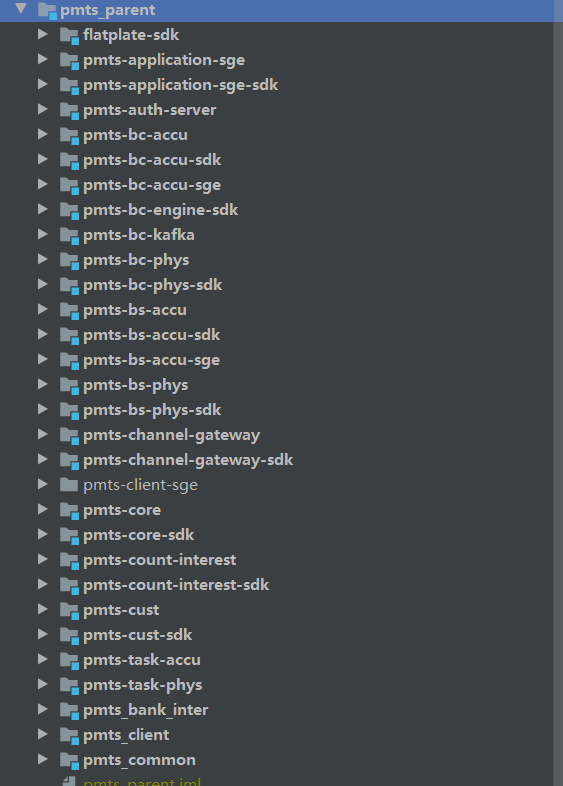

# 积存金项目架构

## 前言

### 模块功能介绍

1. 对积存金的不同模块功能进行介绍
   1. 业务 方向：业务功能，在项目中起到什么作用
   2. 技术 方向：技术栈，为什么会用到什么技术栈，相较于其他模块有什么特殊的技术点

### pmts_parent

#### flatplate-sdk

业务：平盘服务sdk，积存金系统中部分交易需要触发平盘，此处需求未深入了解

技术：采用Kafka推送到平盘

业务：

技术：

#### pmts-application-sge

业务：上海黄金交易所对应的相关业务，交易所兑换相关

技术：没什么特别的技术，无非就是涉及到的交易所相关的接口，另外说一句交易所的接口文档，协议文档等文档 很不错，详细且准确

#### pmts-bc-accu

业务：积存金相关的核心业务模块

技术：redis，Kafka(涉及交易，发送平盘)