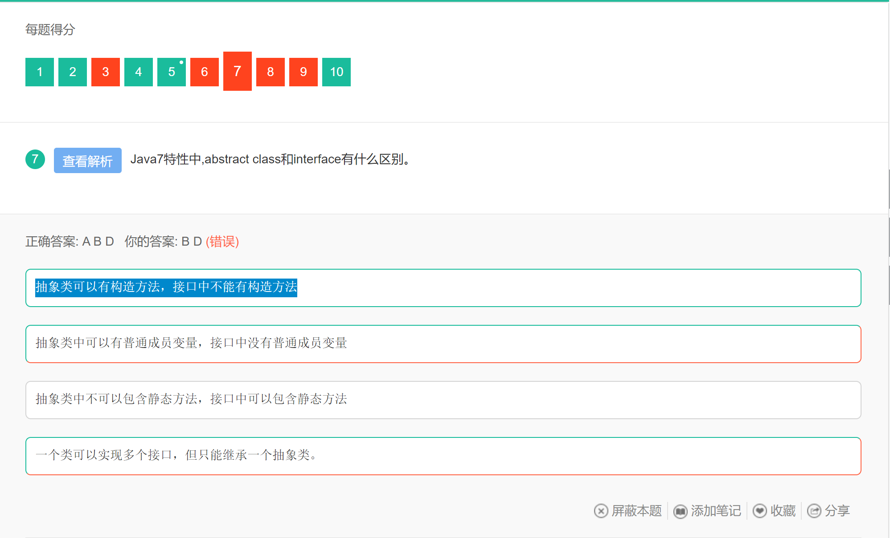
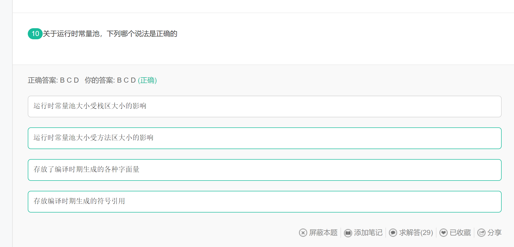

## 错题集

### 第一天

题解额：选线B描述的C语言；选项C中，string类型比较内容时可以使用equals方法，因为String类重写了equals方法；char类型在Java中存储的是Unicode，不仅可以存储ASCII值，还可以存储汉字，所以这里错选d选项主要还是对于char类型的编码类型不够了解

------

 

题解：此题普及 无效等价类的概念：即不满足程序输入要求或者无效的输入数据构成的集合。与有效等价类含义相反

------

题解：题目考察对于集合体系概念的了解；因为不熟悉，所以导致的犯错，如下位集合体系的简单结构图

------

**此题考查 抽象类和接口的区别**

------

此题考察集合体系中的线程安全和线程不安全的分类。

以下为参考答案，也有网友总结为 V SHE ，vector，stack，hashtable，enumeration

-------

考察对Java反射机制的了解

1. A中Class类是在lang包下的
2. D选项中反射是动态获取一个类的信息，而不是修剪
3. F选项中，反射降低执行效率不是通过缓存就可以解决的，反射带来的效率问题主要是动态解析类，JVM没法对反射代码优化

-------

这一题也很有代表性，考察了对Java内存空间的了解，对于常量池中包含哪些元素需要进一步了解