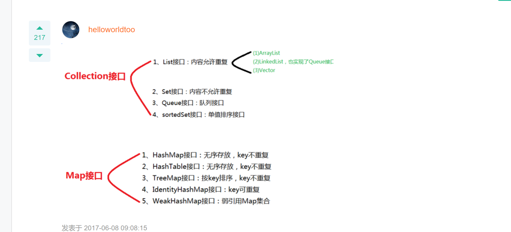
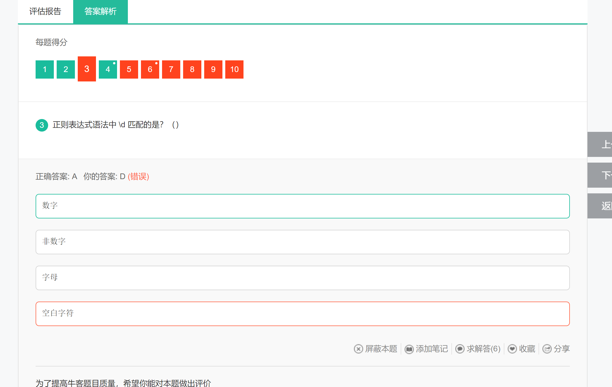

## 错题集

### 第一天


题解额：选线B描述的C语言；选项C中，string类型比较内容时可以使用equals方法，因为String类重写了equals方法；char类型在Java中存储的是Unicode，不仅可以存储ASCII值，还可以存储汉字，所以这里错选d选项主要还是对于char类型的编码类型不够了解


------

 


题解：此题普及 无效等价类的概念：即不满足程序输入要求或者无效的输入数据构成的集合。与有效等价类含义相反


------


题解：题目考察对于集合体系概念的了解；因为不熟悉，所以导致的犯错，如下位集合体系的简单结构图




------


**此题考查 抽象类和接口的区别**

------


此题考察集合体系中的线程安全和线程不安全的分类。

以下为参考答案，也有网友总结为 V SHE ，vector，stack，hashtable，enumeration


-------


考察对Java反射机制的了解

1. A中Class类是在lang包下的
2. D选项中反射是动态获取一个类的信息，而不是修剪
3. F选项中，反射降低执行效率不是通过缓存就可以解决的，反射带来的效率问题主要是动态解析类，JVM没法对反射代码优化


-------


这一题也很有代表性，考察了对Java内存空间的了解，对于常量池中包含哪些元素需要进一步了解


### 第二天(6月14日)

#### 正则表达式



考察对正则表达式的掌握，此题不会，瞎猜的

```
\d      匹配一个数字字符。等价于 [0-9]。
\D     匹配一个非数字字符。等价于 [^0-9]。
\f       匹配一个换页符。等价于 \x0c 和 \cL。
\n      匹配一个换行符。等价于 \x0a 和 \cJ。
\r       匹配一个回车符。等价于 \x0d 和 \cM。
\s      匹配任何空白字符，包括空格、制表符、换页符等等。等价于 [ \f\n\r\t\v]。
\S      匹配任何非空白字符。等价于 [^ \f\n\r\t\v]。
\t       匹配一个制表符。等价于 \x09 和 \cI。
\v      匹配一个垂直制表符。等价于 \x0b 和 \cK。
\w     匹配字母、数字、下划线。等价于'[A-Za-z0-9_]'。
\W    匹配非字母、数字、下划线。等价于 '[^A-Za-z0-9_]'。
```


------


#### Java封装Socket


Java封装socket，未使用过，瞎猜的


-------


#### volatile关键字


